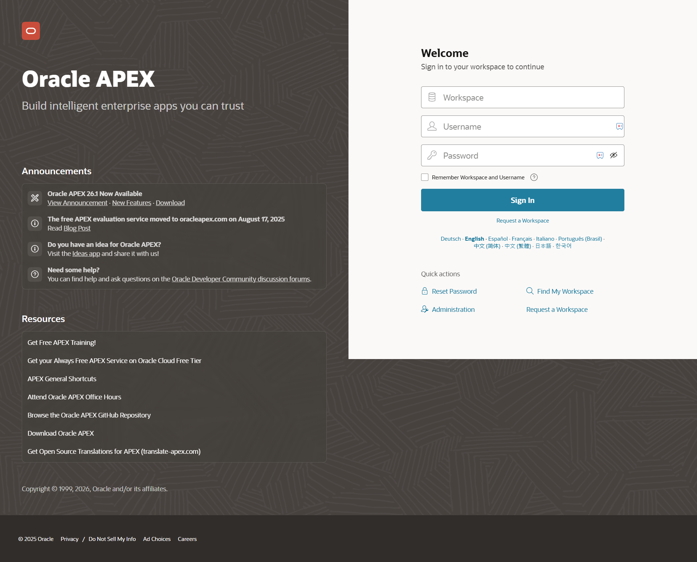
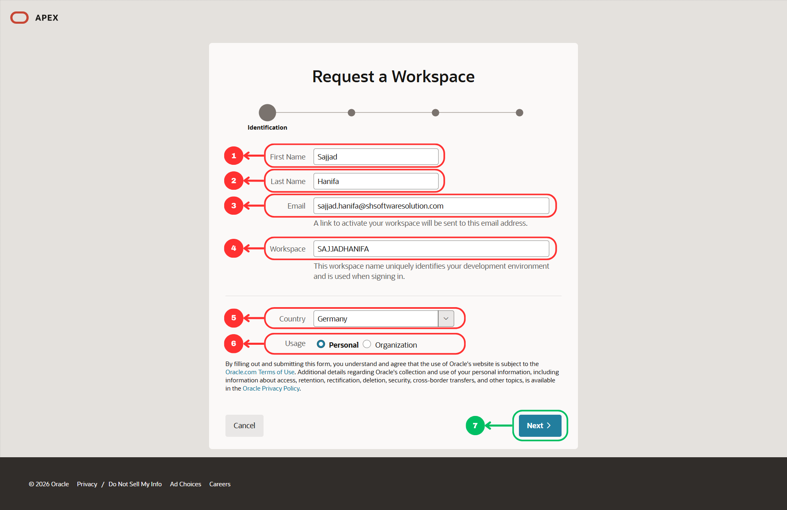
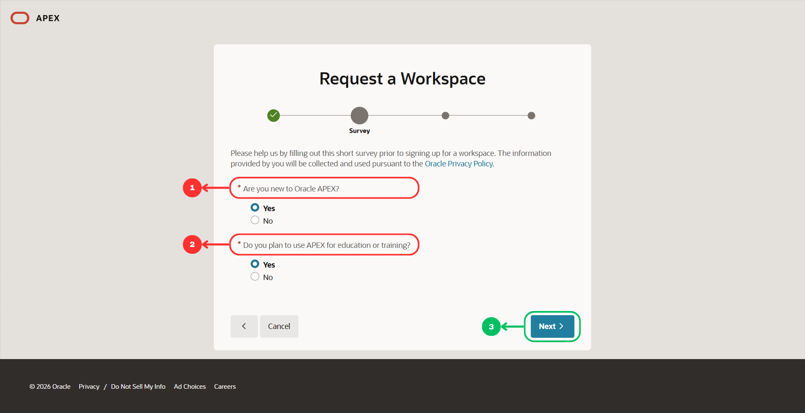
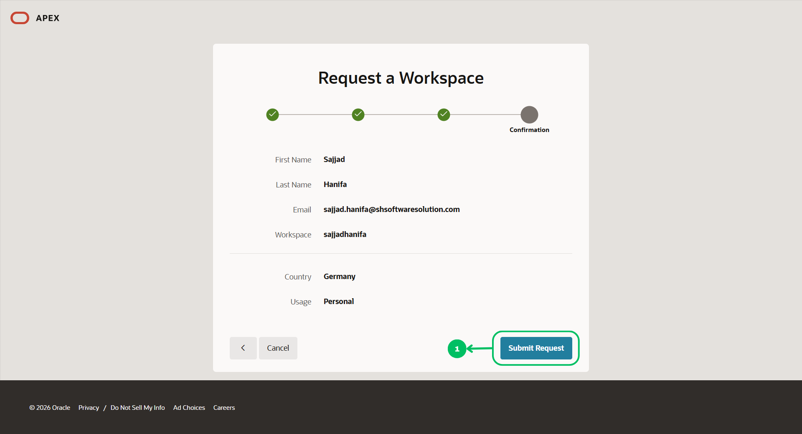
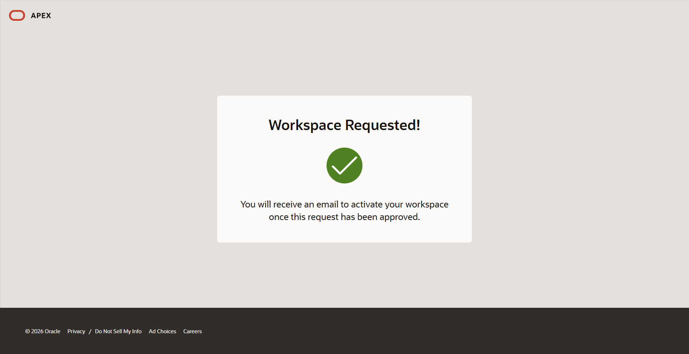
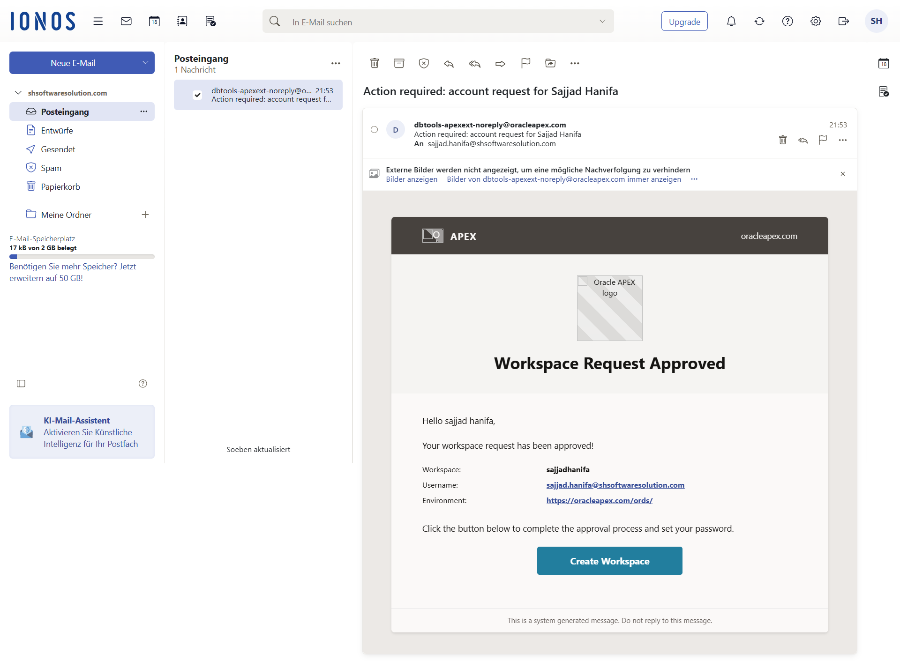
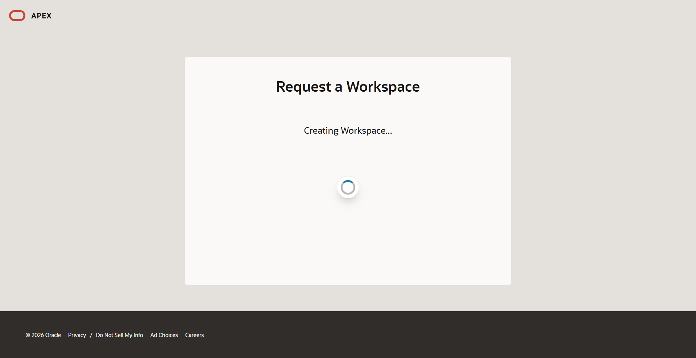
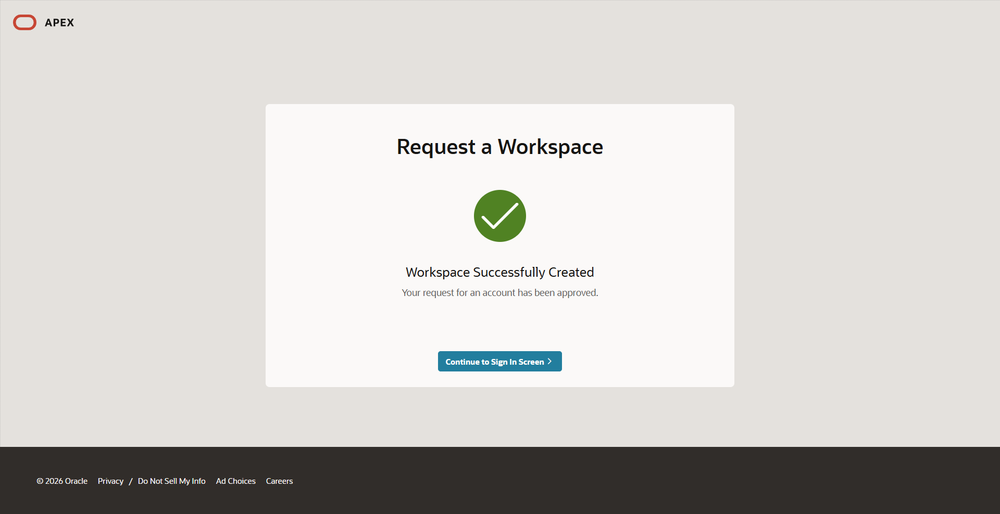
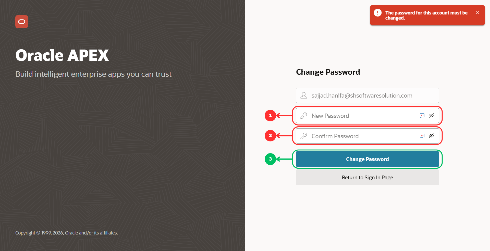
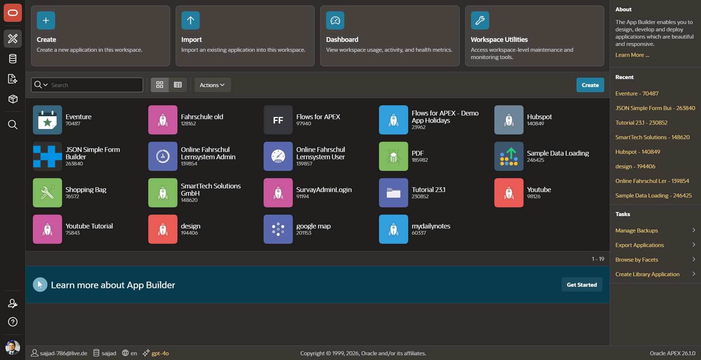

<!--
  Workshop : Oracle APEX Workshop
  Chapter  : 01 – Create a Workspace
  Author   : Sajjad Hanifa
  Company  : S&H Software Solutions
  Website  : https://shsoftwaresolution.com
  Version  : 2.0.0
  Date     : 2026-05-18
-->

# Chapter 01 – Create a Workspace

> ⏱ Estimated Time: ~15 Minutes

---

## What is a Workspace?

A workspace is your personal working environment in Oracle APEX. All apps, tables, and data you create live inside this workspace. The workspace name is unique and always required when logging in. Think of it as your own closed-off project room — nobody else can access it.

---

## Step 1 – Open the Official APEX Page

Open your browser and navigate to the following URL:

https://apex.oracle.com/ords/r/apex/workspace-sign-in/oracle-apex-sign-in

You will see the official Oracle APEX login page. There are three input fields: **Workspace**, **Username**, and **Password**. Below that is a checkbox **„Remember Workspace and Username"** and the blue **„Sign In"** button.

On the right side under **Quick Actions** you will find the link **„Request a Workspace"**. Since we don't have a workspace yet, click on it.

---

## Step 2 – Identification (Wizard Step 1 of 4)

The „Request a Workspace" wizard opens. At the top you can see a progress bar with 4 dots — we are currently on step 1: **Identification**.

Fill in the fields as follows:

- **First Name** → e.g. `Sajjad`
- **Last Name** → e.g. `Hanifa`
- **Email** → your valid email address, e.g. `sajjad.hanifa@shsoftwaresolution.com` — the activation link will be sent to this address
- **Workspace** → choose a unique name, only letters and numbers allowed, e.g. `SAJJADHANIFA` — this name is used when signing in and cannot be changed later
- **Country** → `Germany`
- **Usage** → select **„Personal"** for this workshop

Then click **„Next"**.

---

## Step 3 – Survey (Wizard Step 2 of 4)

In the second step Oracle asks two short questions. The answers help Oracle improve the platform and have no effect on your workspace.

- **„Are you new to Oracle APEX?"** → select **„Yes"**
- **„Do you plan to use APEX for education or training?"** → select **„Yes"**

Click **„Next"**.

---

## Step 4 – Agreement (Wizard Step 3 of 4)

You will now see the **Oracle APEX Service Agreement** — the terms of use. Scroll down and read through the text. Afterwards check the **„I accept the terms"** checkbox.

Click **„Next"**.

---

## Step 5 – Confirmation (Wizard Step 4 of 4)

In the last step you see a summary of all entered data for review:

- First Name: Sajjad
- Last Name: Hanifa
- Email: sajjad.hanifa@shsoftwaresolution.com
- Workspace: sajjadhanifa
- Country: Germany
- Usage: Personal

Everything correct? Then click **„Submit Request"**.

---

## Step 6 – Request Submitted

After clicking „Submit Request" you will see a confirmation screen with a green checkmark and the message **„Workspace Requested!"**

Oracle will now review your request and send an approval email to the address you provided. This usually takes just a few minutes — also check your spam folder if nothing arrives.

---

## Step 7 – Approval Email

Open your inbox and look for an email from Oracle APEX with the subject **„Action required: account request for ..."**. The email confirms that your workspace request has been approved.

Click the blue **„Create Workspace"** button inside the email.

---

## Step 8 – Creating Workspace

After clicking the button in the email, your browser opens and Oracle starts creating your workspace automatically. You will see the message **„Creating Workspace..."** with a loading spinner.

This only takes a few seconds — just wait for it to finish.

---

## Step 9 – Workspace Successfully Created

Once the process is complete, you will see the message **„Workspace Successfully Created"** with a green checkmark.

Click **„Continue to Sign In Screen"** to proceed.

---

## Step 10 – Set Your Password

You will now be redirected to the **Change Password** page. Oracle requires you to set a new password before your first login.

Enter your new password in both fields and click **„Change Password"**.

> 💡 Your password must be at least 8 characters long and contain uppercase letters, lowercase letters, at least one number, and one special character.

---

## Step 11 – App Builder Home

After logging in you will land directly in the **App Builder**. This is your main working area throughout the entire workshop.

At the top you can see four main actions: **Create** (create a new app), **Import** (import an app), **Dashboard** (usage statistics), and **Workspace Utilities** (workspace settings). Below that, all your apps will appear as you build them.

---

## Summary

- A workspace is your personal working environment in Oracle APEX
- Every participant now has access to their own workspace
- In the next chapter we will import the data we will use throughout the entire workshop

---

[↑ Back to Overview](https://github.com/Sajjad-786/oracle-apex-workshop/blob/main/README.md) | [→ Chapter 02](https://github.com/Sajjad-786/oracle-apex-workshop/blob/main/02_chapter_sql_import/02_chapter.md)
