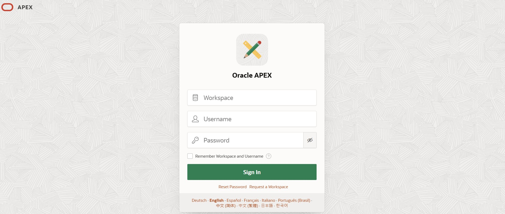
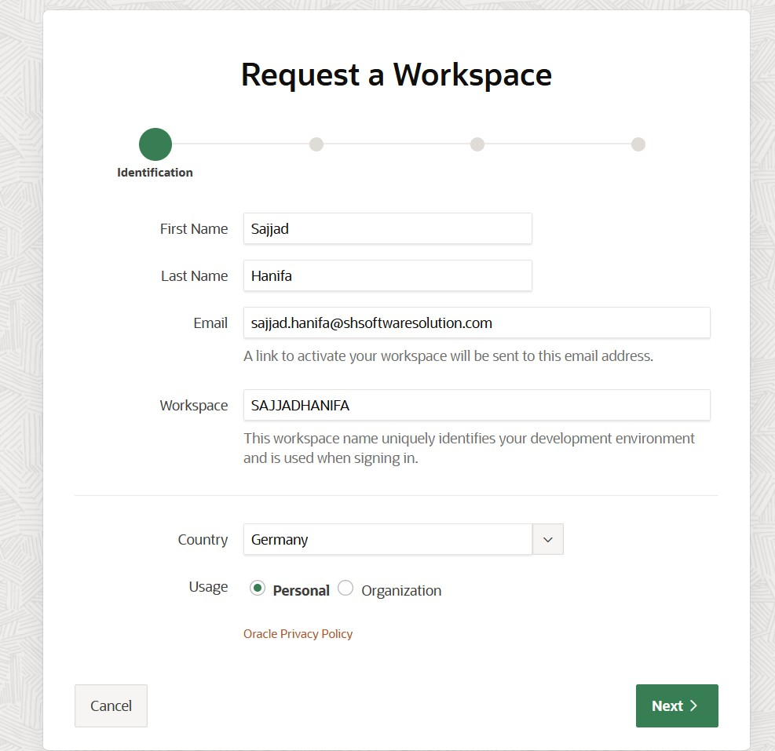
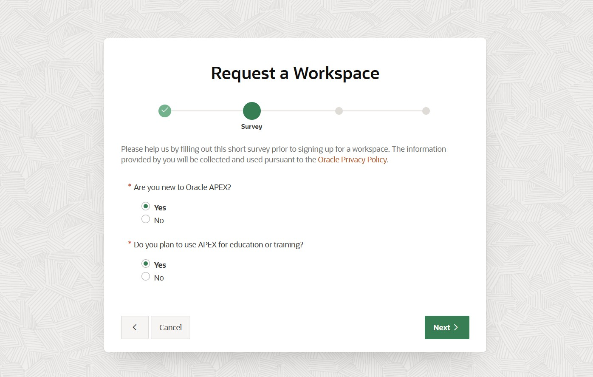
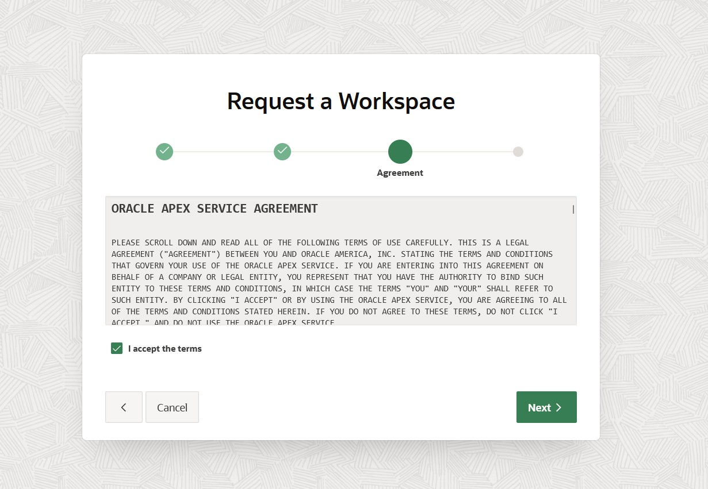
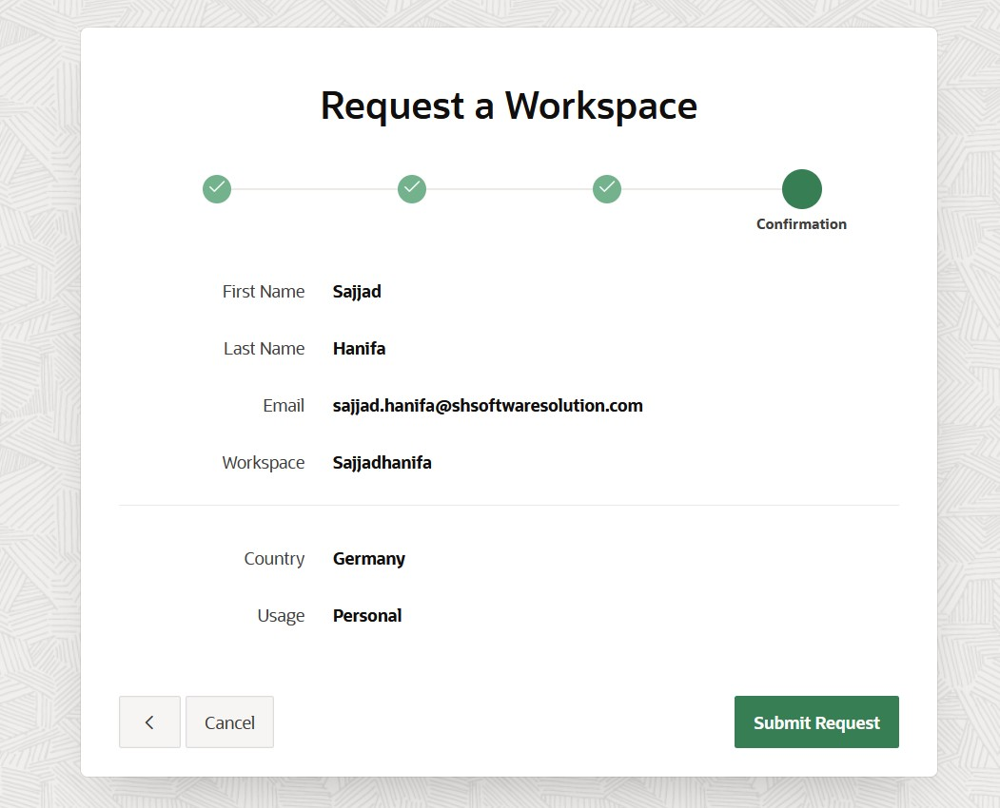
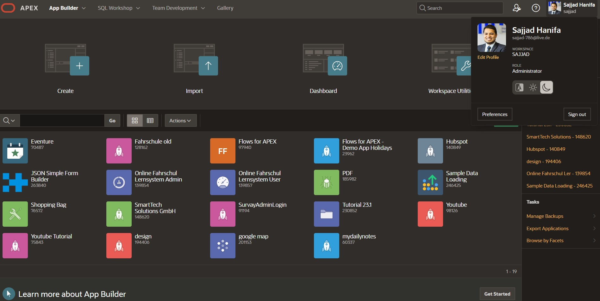

<!--
  Workshop : Oracle APEX Workshop
  Chapter  : 01 – Create a Workspace
  Author   : Sajjad Hanifa
  Company  : S&H Software Solutions
  Website  : https://shsoftwaresolution.com
  Version  : 1.0.0
  Date     : 2026-05-14
-->

# Chapter 01 – Create a Workspace

> ⏱ Estimated Time: ~15 Minutes

---

## What is a Workspace?

A workspace is your personal working environment in Oracle APEX. All apps, tables, and data you create live inside this workspace. The workspace name is unique and always required when logging in. Think of it as your own closed-off project room — nobody else can access it.

---

## Step 1 – Open the Official APEX Page

Open your browser and navigate to the following URL:

https://apex.oracle.com/ords/r/apex/workspace-sign-in/oracle-apex-sign-in

You will see the official Oracle APEX login page. There are three input fields: **Workspace**, **Username**, and **Password**. Below that is a checkbox „Remember Workspace and Username" and the green **„Sign In"** button.

At the very bottom of the page you will find two links: **„Reset Password"** and **„Request a Workspace"**. Since we don't have a workspace yet, click on **„Request a Workspace"**.

---

## Step 2 – Identification (Wizard Step 1 of 4)

The „Request a Workspace" wizard opens. At the top you can see a progress bar with 4 dots — we are currently on step 1: **Identification**.

Fill in the fields as follows:

- **First Name** → e.g. `Sajjad`
- **Last Name** → e.g. `Hanifa`
- **Email** → your valid email address, e.g. `sajjad.hanifa@shsoftwaresolution.com` — the activation link will be sent to this address
- **Workspace** → choose a unique name, only letters and numbers allowed, e.g. `SAJJADHANIFA` — this name is used when signing in and cannot be changed later
- **Country** → `Germany`
- **Usage** → select **„Personal"** for this workshop

Then click **„Next"**.

---

## Step 3 – Survey (Wizard Step 2 of 4)

In the second step Oracle asks two short questions. The answers help Oracle improve the platform and have no effect on your workspace.

- **„Are you new to Oracle APEX?"** → select **„Yes"**
- **„Do you plan to use APEX for education or training?"** → select **„Yes"**

Click **„Next"**.

---

## Step 4 – Agreement (Wizard Step 3 of 4)

You will now see the **Oracle APEX Service Agreement** — the terms of use. Scroll down and read through the text. Afterwards check the **„I accept the terms"** checkbox.

Click **„Next"**.

---

## Step 5 – Confirmation (Wizard Step 4 of 4)

In the last step you see a summary of all entered data for review:

- First Name: Sajjad
- Last Name: Hanifa
- Email: sajjad.hanifa@shsoftwaresolution.com
- Workspace: Sajjadhanifa
- Country: Germany
- Usage: Personal

Everything correct? Then click **„Submit Request"**.

---

## Step 6 – Email Confirmation

Oracle will now send a confirmation email to the address you provided. This usually takes 1–2 minutes. Also check your spam folder if nothing arrives.

Open the email and click on the activation link. You will be redirected to a page where you can set your password. The password must meet the following requirements: at least 8 characters, upper and lowercase letters, at least one number and one special character.

---

## Step 7 – Sign In

Go back to the login page and enter:

- **Workspace** → `SAJJADHANIFA`
- **Username** → `ADMIN`
- **Password** → the password you just set

Click **„Sign In"**.

---

## Step 8 – App Builder Home

After logging in you will land directly in the **App Builder**. At the top you can see the main navigation with **App Builder**, **SQL Workshop**, **Team Development**, and **Gallery**.

If you click on your name in the top right corner, a profile popup opens. There you can see your full name, your email, your workspace name, and your role — in our case **Administrator**.

Inside the App Builder itself there are four main actions: **Create** (create a new app), **Import** (import an app), **Dashboard** (statistics), and **Workspace Utilities** (workspace settings). Below that, all your apps will appear later.

---

## Summary

- A workspace is your personal working environment in Oracle APEX
- Every participant now has access to their own workspace
- In the next chapter we will import the data we will use throughout the entire workshop

---

[← Back to Overview](../README.md) | [→ Chapter 02](../chapter-02-sql-import/chapter-02.md)
