<!--
  Workshop : Oracle APEX Workshop
  Chapter  : 02 – SQL Import
  Author   : Sajjad Hanifa
  Company  : S&H Software Solutions
  Website  : https://shsoftwaresolution.com
  Version  : 2.0.0
  Date     : 2026-05-19
-->

# Chapter 02 – SQL Import

> ⏱ Estimated Time: ~20 Minutes

---

## What We Are Building

Before we create our first app, we need a database structure with some sample data. In this chapter we will import a ready-made SQL script that creates all 6 tables and fills them with test data automatically.

Here is an overview of the database model we will be working with throughout the entire workshop:

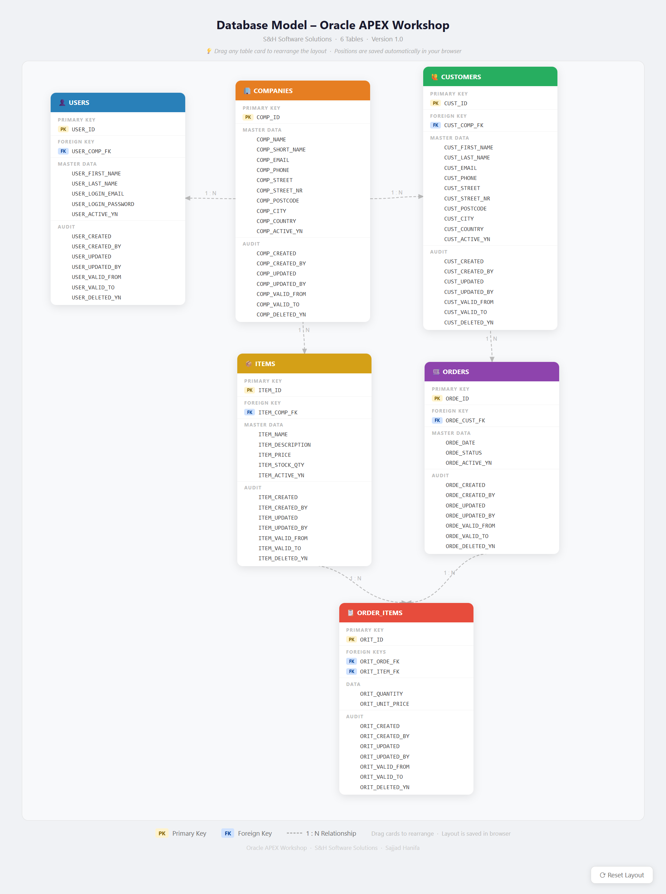

The model consists of 6 tables:

- **COMPANIES** – the root table, every record belongs to a company
- **USERS** – system users within a company
- **CUSTOMERS** – customers who place orders
- **ITEMS** – products available for ordering
- **ORDERS** – a customer order
- **ORDER_ITEMS** – the individual items inside an order (junction table)

---

## Step 1 – Sign In to APEX

Open your browser and navigate to:

https://apex.oracle.com/ords/r/apex/workspace-sign-in/oracle-apex-sign-in

Enter your **Workspace**, **Username**, and **Password** and click **„Sign In"**.

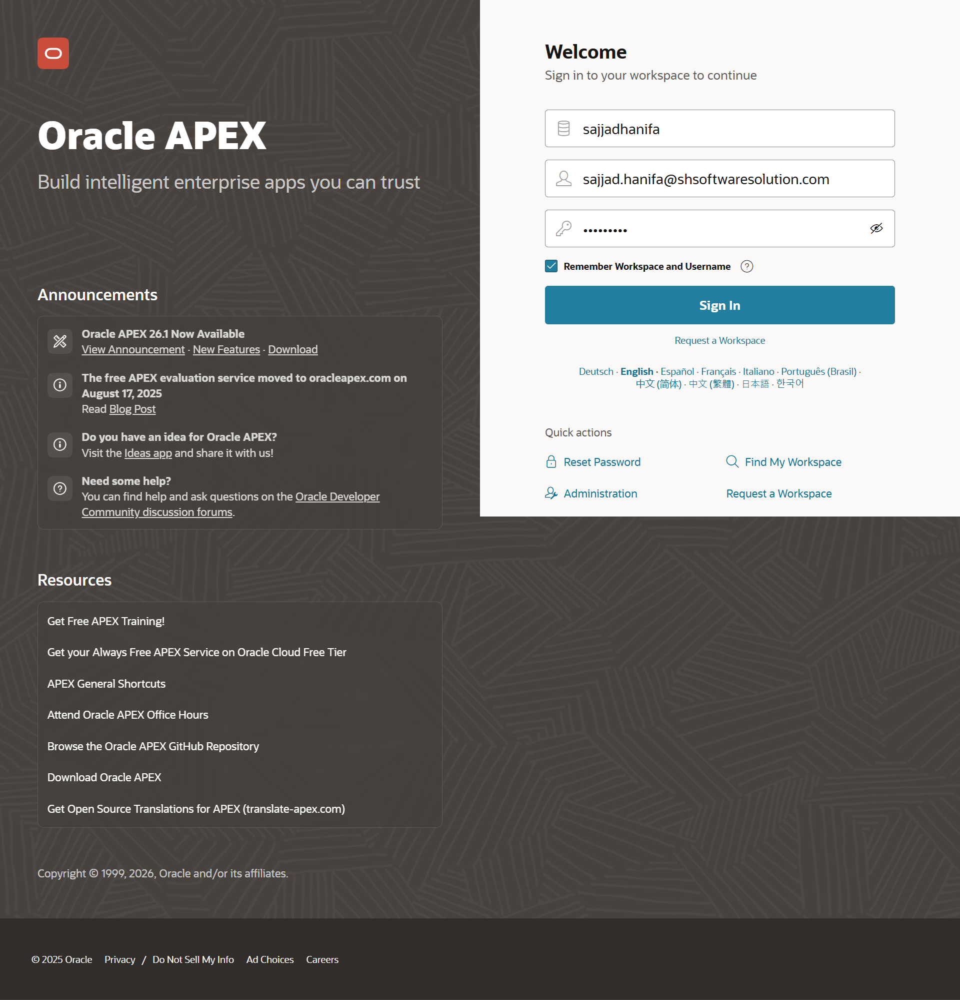

---

## Step 2 – Navigate to SQL Workshop

After signing in you will land on the APEX Home. Click on **„SQL Workshop"** in the main navigation.

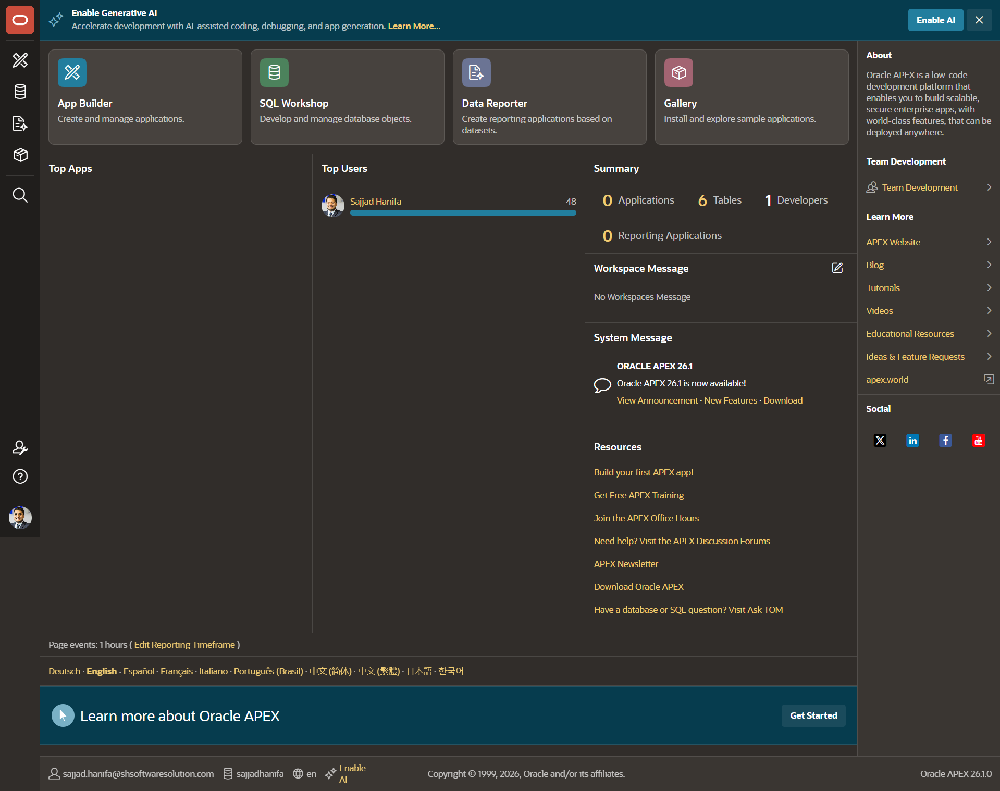

---

## Step 3 – Open SQL Workshop

You will now see the SQL Workshop overview with five tools: **Object Browser**, **SQL Commands**, **SQL Scripts**, **Utilities**, and **RESTful Services**.

Click on **„SQL Scripts"**.

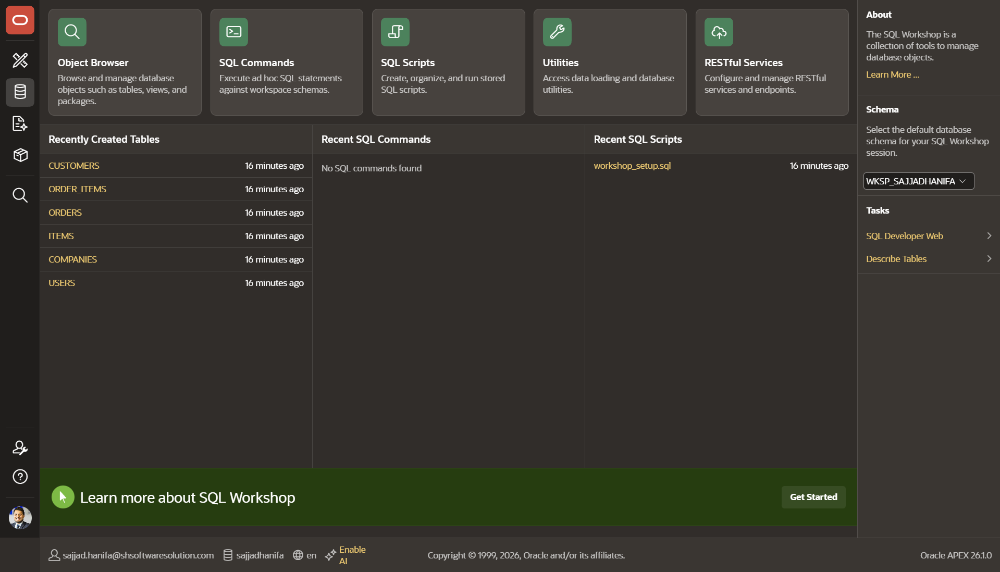

---

## Step 4 – SQL Scripts (Empty)

The SQL Scripts area is empty — no scripts have been uploaded yet. This is where we will upload our setup script.

Click on **„Upload"**.

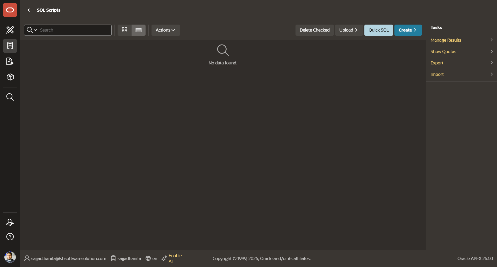

---

## Step 5 – Upload Dialog

The Upload Script dialog opens. Click **„Choose File"** and select the file `workshop_setup.sql` from your local machine.

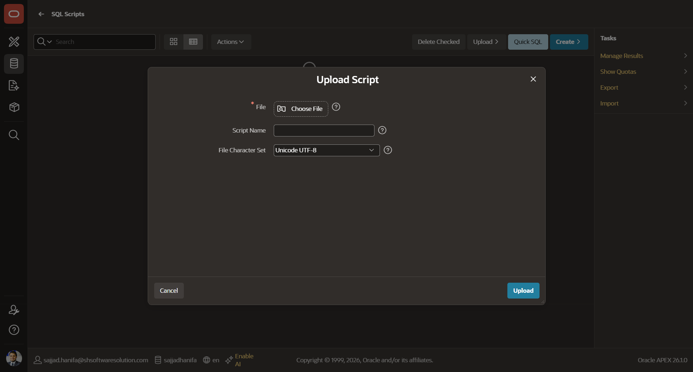

---

## Step 6 – File Selected

After selecting the file you will see `workshop_setup.sql` shown in the file field. Leave **Script Name** empty — APEX will use the filename automatically. Leave **File Character Set** as `Unicode UTF-8`.

Click **„Upload"**.

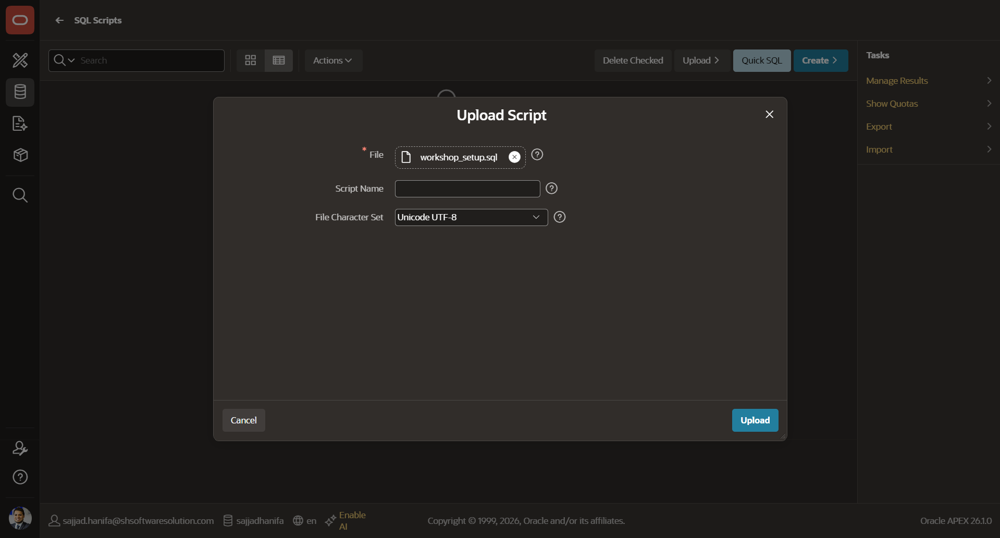

---

## Step 7 – Script Uploaded

You are back on the SQL Scripts page and can now see `workshop_setup.sql` in the list — 34,741 bytes, 0 results so far.

Click on the **script name** `workshop_setup.sql` to open the Script Editor.

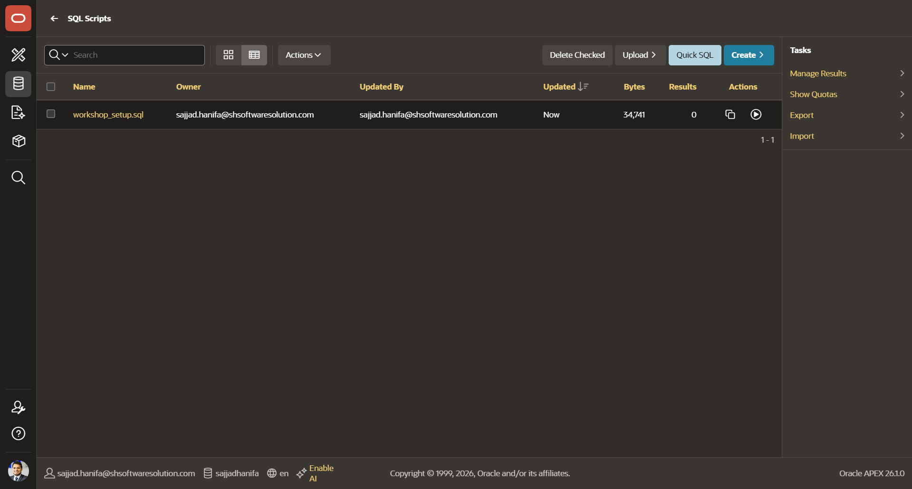

---

## Step 8 – Script Editor

APEX opens the Script Editor and shows the full SQL code. You can scroll through it to see all the table definitions and INSERT statements.

Click **„Run"** in the top right corner.

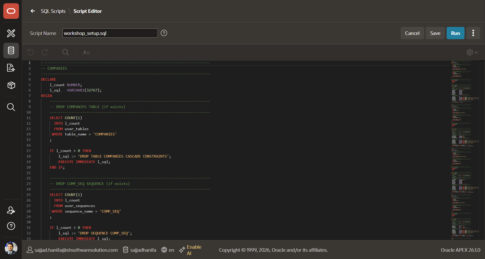

---

## Step 9 – Confirm Run

APEX shows a confirmation screen with the script details — **66 statements**, script size 35,525 bytes.

Click **„Run"** to execute.

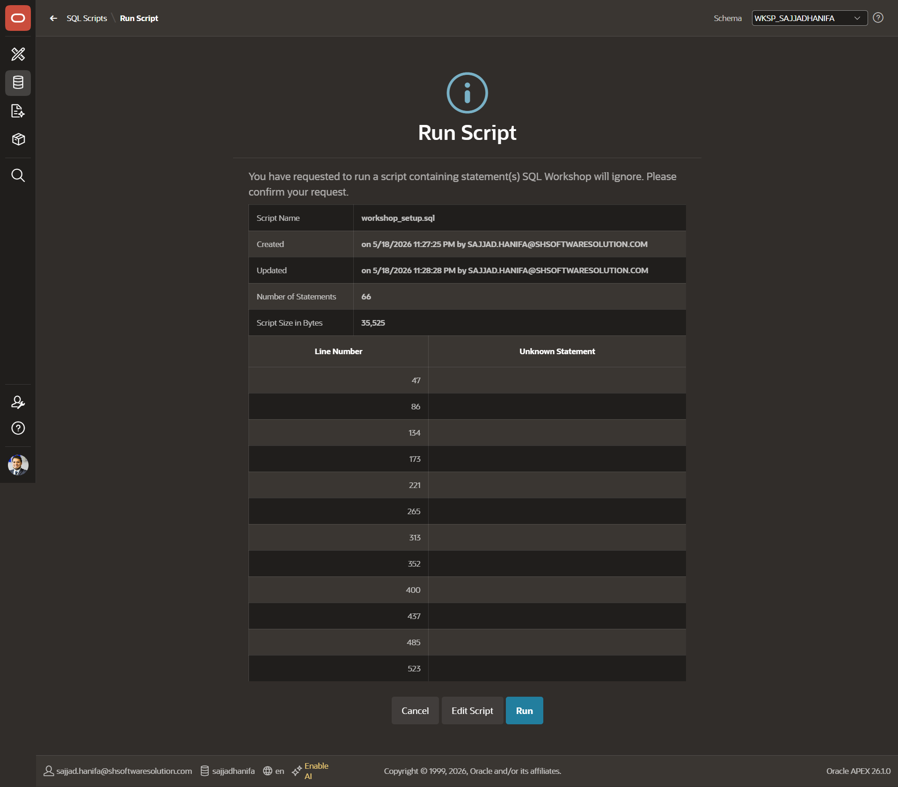

---

## Step 10 – Results

APEX executes all 66 statements. You will see a results table showing each statement with its feedback.

At the bottom you should see: **66 Statements Processed · 66 Successful · 0 With Errors**

> ⚠️ If you see any errors, check that you ran `workshop_setup.sql` and not an older file. You can run the script again — the DROP blocks at the beginning will clean up automatically.

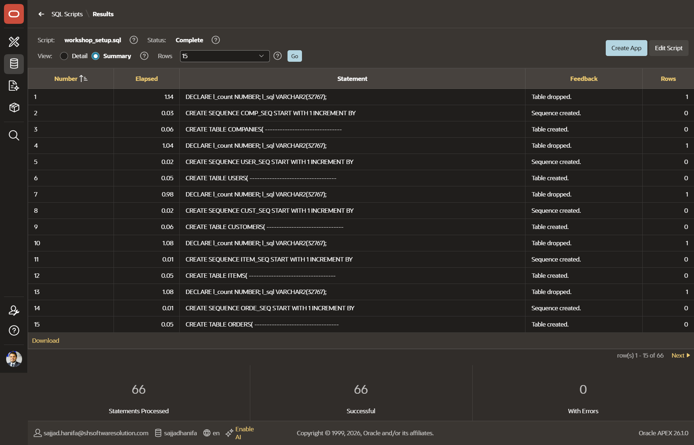

---

## Step 11 – Verify in Object Browser

Go back to **SQL Workshop → Object Browser**. On the left side under **Tables** you should now see all 6 tables:

- COMPANIES
- CUSTOMERS
- ITEMS
- ORDERS
- ORDER_ITEMS
- USERS

And under **Sequences** all 6 sequences: COMP_SEQ, CUST_SEQ, ITEM_SEQ, ORDE_SEQ, ORIT_SEQ, USER_SEQ.

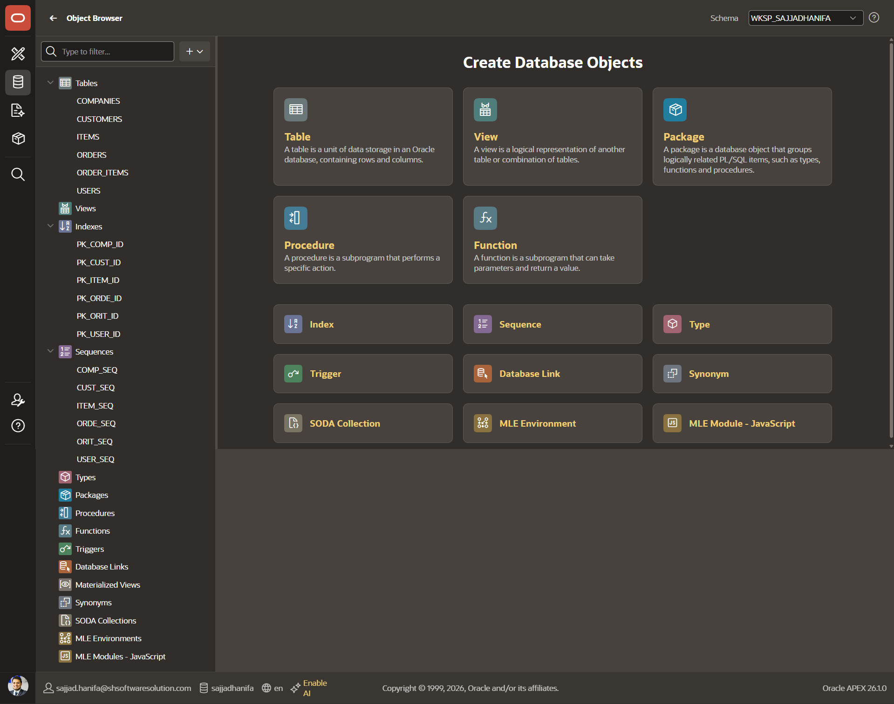

---

## Task – Create the REVIEWS Table

Now it is your turn. Create a **REVIEWS** table in **SQL Workshop → SQL Commands** using the following structure:

| Column | Type | Note |
|---|---|---|
| `REVW_ID` | NUMBER | PK, DEFAULT `REVW_SEQ.NEXTVAL` |
| `REVW_CUST_FK` | NUMBER | FK → CUSTOMERS |
| `REVW_ITEM_FK` | NUMBER | FK → ITEMS |
| `REVW_RATING` | NUMBER(1) | NOT NULL — values 1 to 5 |
| `REVW_COMMENT` | CLOB | |
| `REVW_ACTIVE_YN` | VARCHAR2(4) | DEFAULT `'YES'` |
| Audit columns | — | CREATED, UPDATED, VALID_FROM/TO, DELETED_YN |

**Step 1** — First create the sequence. Open **SQL Commands** and type out the `CREATE SEQUENCE` statement for `REVW_SEQ` by hand — use the sequences in `workshop_setup.sql` as your reference.

Click **„Run"**. You will see the confirmation message **„Sequence created."** below the editor.

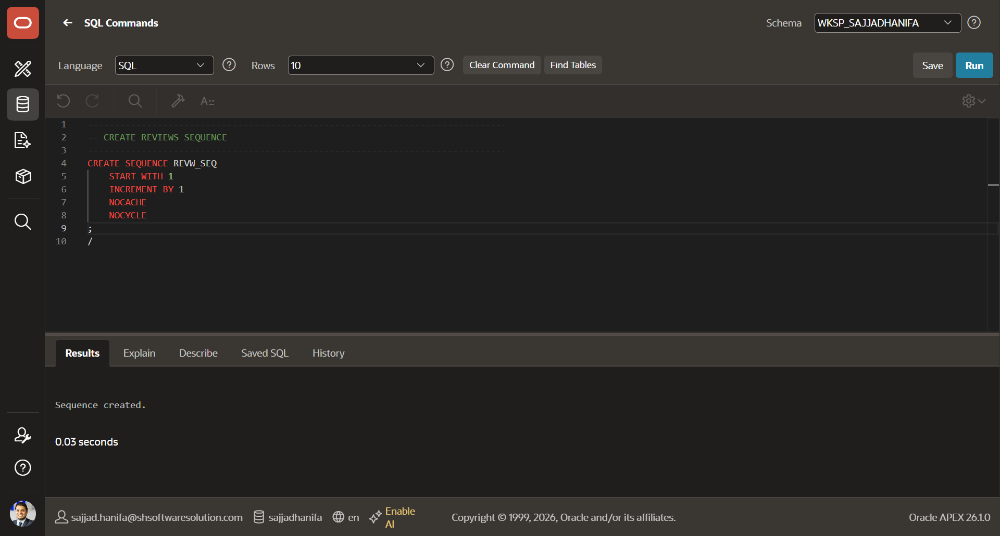

**Step 2** — Now write the full `CREATE TABLE REVIEWS(...)` statement with all columns, defaults, FK constraints, and audit columns — and click **„Run"**.

> 💡 Use the same pattern as the other tables in `workshop_setup.sql` as a reference. Pay close attention to the FK constraints — they must reference `CUSTOMERS (CUST_ID)` and `ITEMS (ITEM_ID)`.

```sql
???
```

After clicking **„Run"** you will see the confirmation message **„Table created."** below the editor.

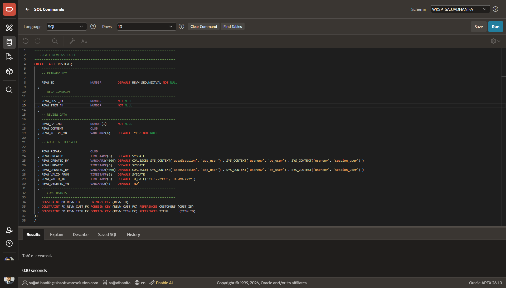

---

## Step 12 – Final Verification

Go back to **SQL Workshop → Object Browser**. You should now see **7 tables** in total — the original 6 plus your new REVIEWS table:

- COMPANIES
- CUSTOMERS
- ITEMS
- ORDERS
- ORDER_ITEMS
- REVIEWS
- USERS

And under **Sequences** all 7 sequences including REVW_SEQ.

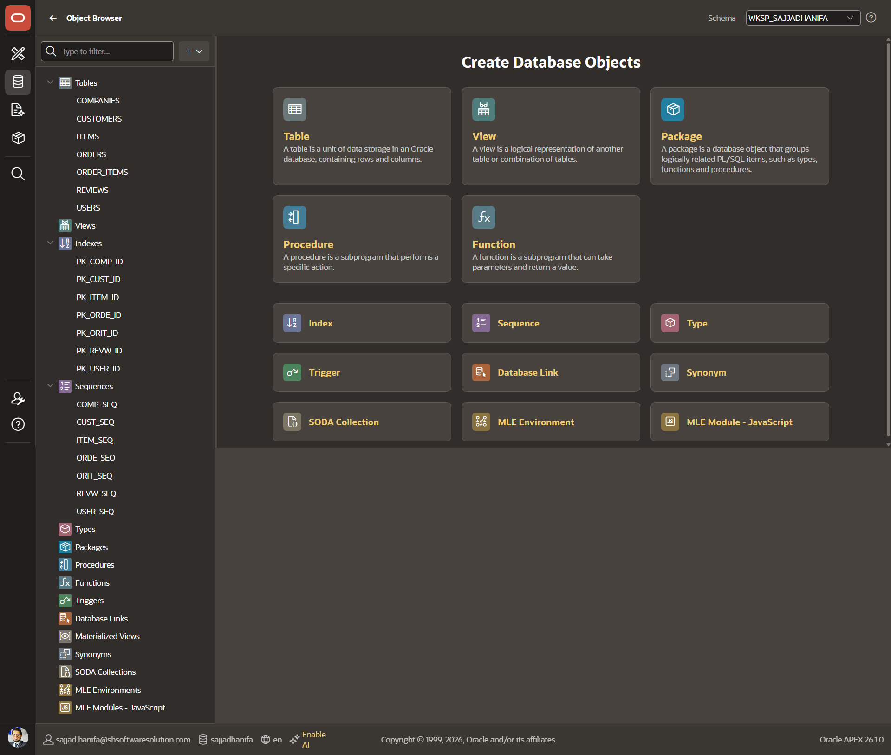

---

## 🎉 Congratulations!

You have successfully completed Chapter 02! You have:

- Imported the full workshop SQL script with all 6 tables and sample data
- Verified the result in the Object Browser
- Created your own REVIEWS table and sequence from scratch using SQL Commands

Your database is now ready — let's start building the app in the next chapter!

---

## Summary

- All 6 workshop tables and sample data are now loaded into your workspace
- You have learned how to upload and run a SQL script in APEX SQL Workshop
- You verified the result in the Object Browser
- You created your first own table — the REVIEWS table — manually using SQL Commands

---

[← Back to Overview](../README.md) | [→ Chapter 03](../03_chapter_create_app/03_chapter.md)
