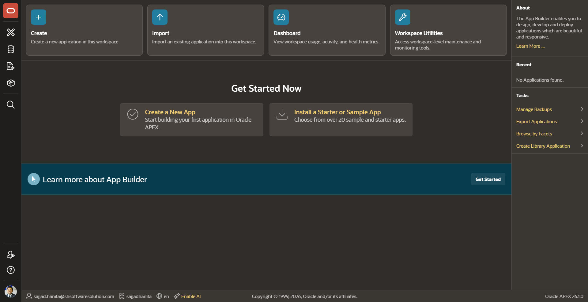
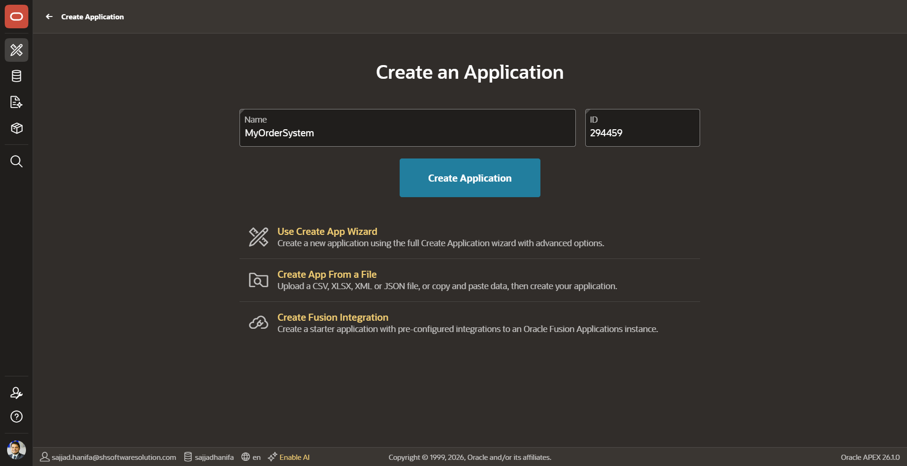
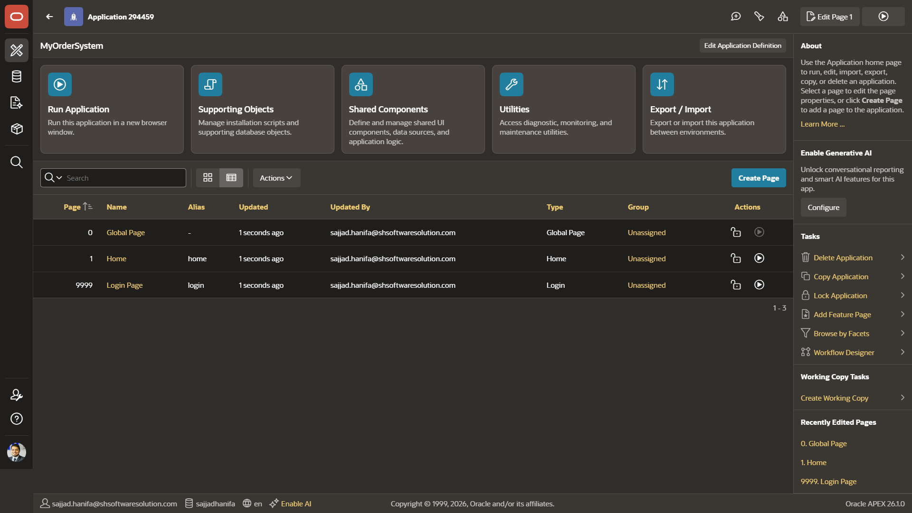
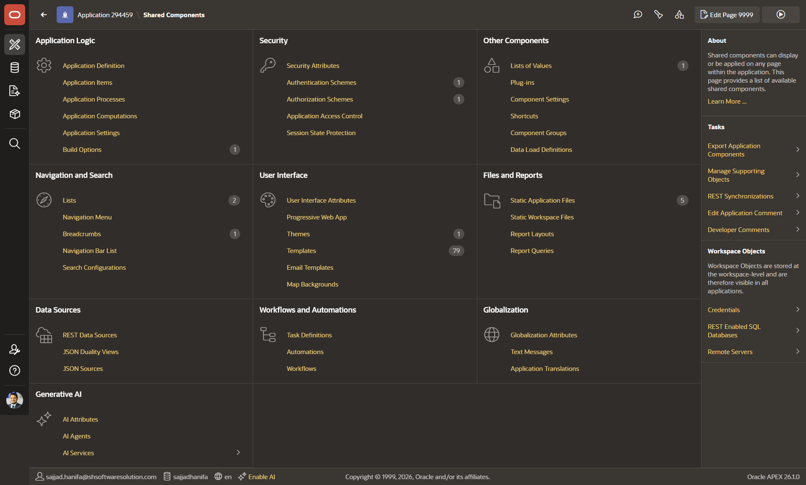
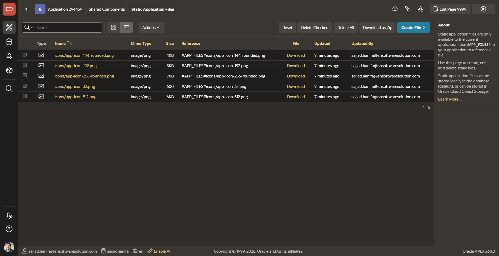
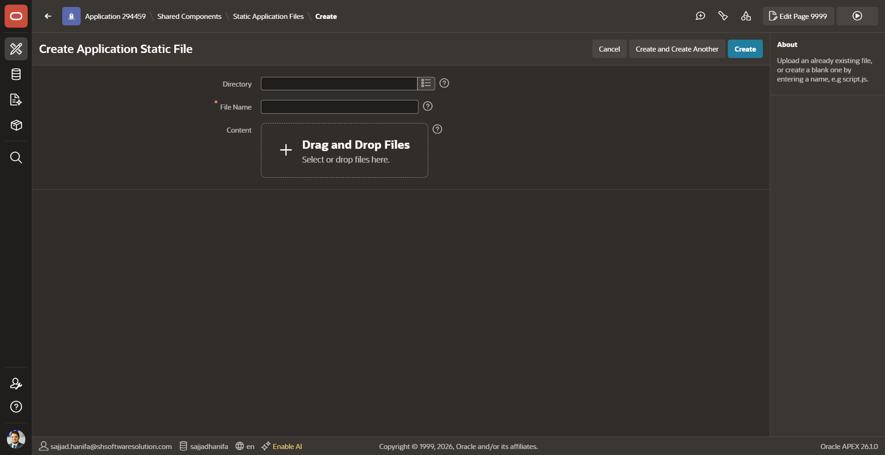
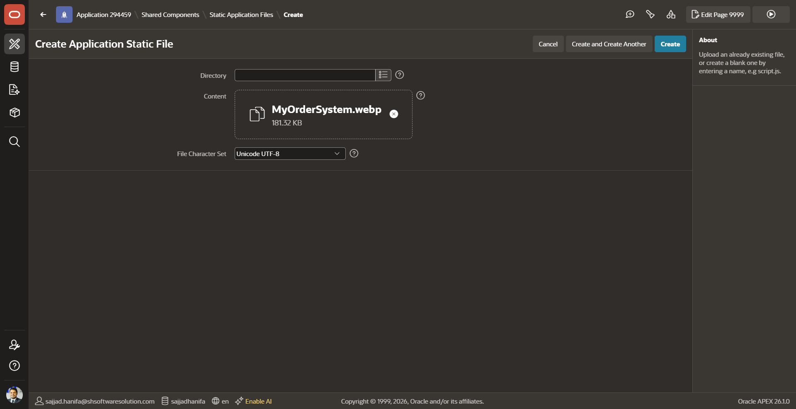
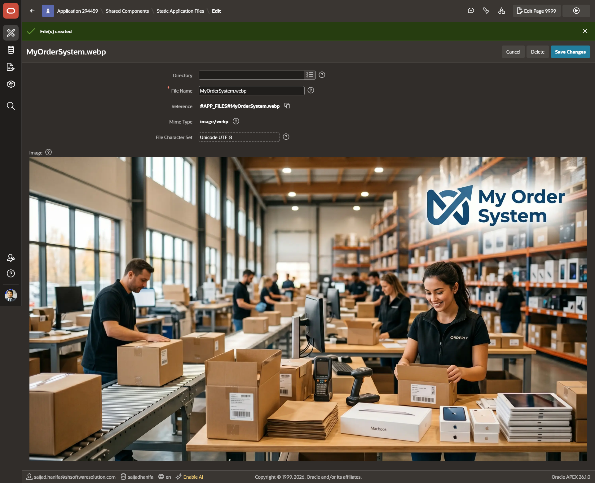
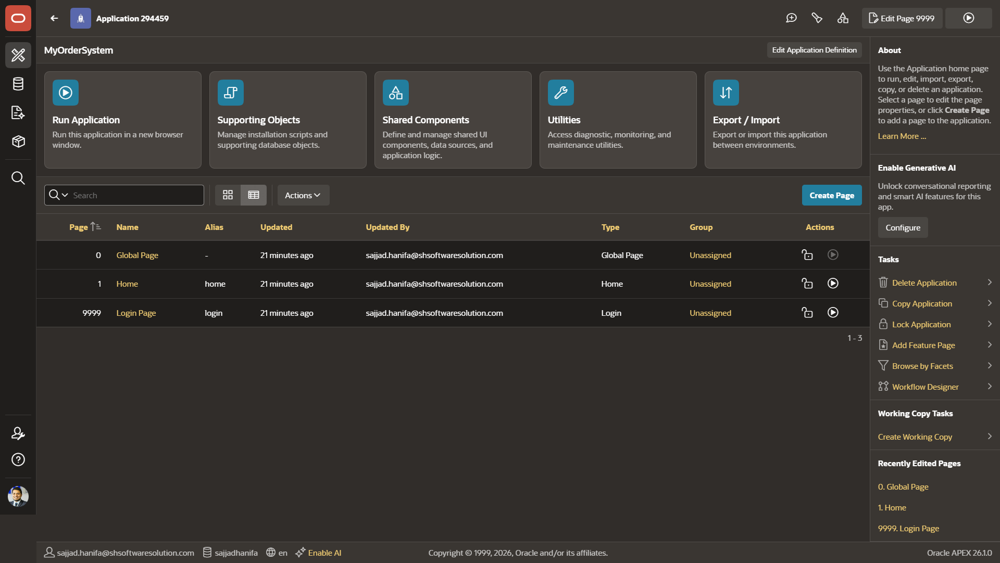
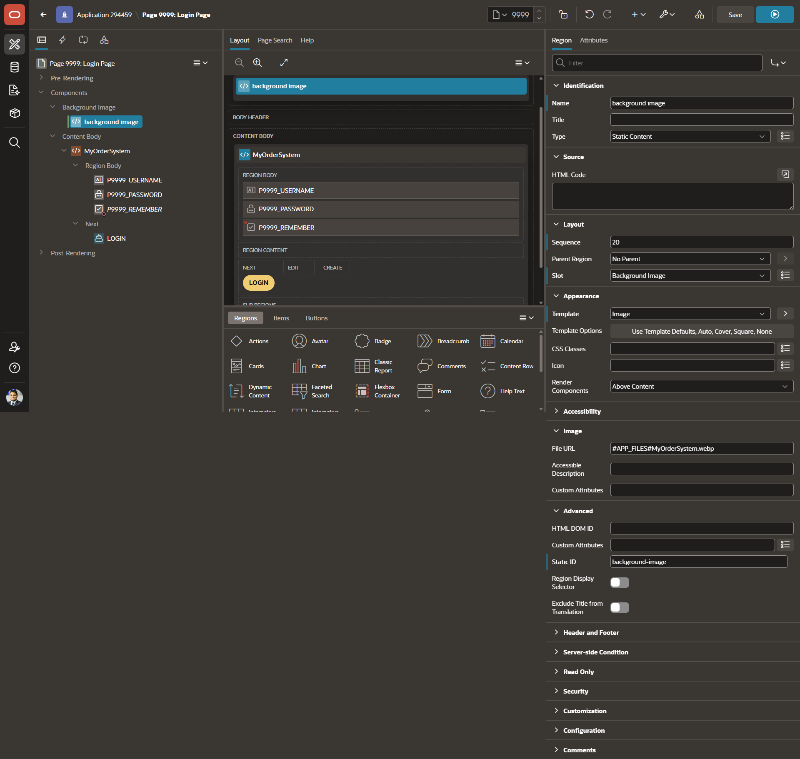

<!--
  Workshop : Oracle APEX Workshop
  Chapter  : 03 – Create an App
  Author   : Sajjad Hanifa
  Company  : S&H Software Solutions
  Website  : https://shsoftwaresolution.com
  Version  : 1.0.0
  Date     : 2026-05-21
-->

# Chapter 03 – Create an App

> ⏱ Estimated Time: ~20 Minutes

---

## What you will learn

In this chapter you will create your very first Oracle APEX application from scratch. By the end of this chapter you will have a working app called **MyOrderSystem** with a Home page and a Login page — including a custom background image on the login screen.

---

## Step 1 – Open the App Builder

Log in to your workspace and open the **App Builder**. You will see the familiar home screen with four action tiles at the top: **Create**, **Import**, **Dashboard**, and **Workspace Utilities**.

In the center of the page you will find two quick-start options. Click on **„Create a New App"**.



---

## Step 2 – Name Your Application

Oracle APEX now shows you the **Create an Application** screen. You will see a **Name** field and an auto-generated **ID** field.

Enter the following value:

- **Name** → `MyOrderSystem`

The **ID** (e.g. `294459`) is assigned automatically — you do not need to change it.

Click the blue **„Create Application"** button.

> 💡 The application ID is unique across your workspace. It appears in all URLs and is referenced as `APP_ID` or `:APP_ID` inside APEX.



---

## Step 3 – App Overview

After clicking **„Create Application"**, APEX creates the app and takes you straight to the **Application home page**.

You will see a list of pages that were automatically created:

| Page # | Alias | Type |
|--------|-------|------|
| 0 | Global Page | Global Page |
| 1 | Home | Normal |
| 9999 | Login Page | Login |

Every new APEX application always includes these three default pages. The **Login Page (9999)** is what users see before they are authenticated — that is exactly the page we will customize next.



---

## Step 4 – Explore Shared Components (optional)

Click on **„Shared Components"** in the top area of the App home. This section lists everything that is shared across all pages of your application — things like authentication schemes, navigation menus, templates, and static files.

Take a moment to explore the overview. We will come back to **Static Application Files** in the next step.

> 💡 Shared Components is one of the most powerful areas in APEX. Anything you put here is available on every single page of your app.



---

## Step 5 – Open Static Application Files

In the **Shared Components** overview, scroll down to the section **„Files and Reports"** and click on **„Static Application Files"**.

You will see a list of files already belonging to your app. These are typically icon files that APEX adds by default (e.g. app icon in different sizes).

To upload your own background image, click the blue **„Create File"** button in the top right corner.



---

## Step 6 – Upload the Background Image

The **Create Application Static File** screen opens. You will see a drag-and-drop area labeled **„Drag and Drop Files"**.

Drag your background image file onto this area — or click it to open a file picker. For this workshop we use the file **`MyOrderSystem.webp`** which is provided in the `scripts/` folder of this chapter.



---

## Step 7 – Confirm the Upload

After dropping the file, you will see it appear in the upload area with its name and file size — in our case **MyOrderSystem.webp (181.32 KB)**.

The **File Character Set** is automatically set to `Unicode UTF-8` — leave this as is.

Click the blue **„Create"** button to upload the file.



---

## Step 8 – File Upload Confirmed

After clicking **„Create"**, APEX confirms with a green **„File(s) created"** banner at the top of the screen.

You can now see the uploaded file with its details:

- **File Name** → `MyOrderSystem.webp`
- **Reference** → `#APP_FILES#MyOrderSystem.webp`
- **Mime Type** → `image/webp`

The **Reference** value is important — this is the token you will use inside APEX to point to this file. Copy it or keep this screen open for the next step.



---

## Step 9 – Open the Login Page in Page Designer

Navigate back to the App home page. In the page list you will see the three default pages again.

Click on **„Login Page"** (Page 9999) to open it in the **Page Designer**.



---

## Step 10 – Set the Background Image

The **Page Designer** opens for Page 9999. In the left panel (the page tree) you will see the page structure. Click on **„Background Image"** to select that component.

On the right side the **Property Editor** updates. Under the **Image** section you will find the **File URL** field.

Enter the reference value from Step 8:

```
#APP_FILES#MyOrderSystem.webp
```

Click **„Save"** (top right) to save your changes.

> 💡 The `#APP_FILES#` token is automatically resolved by APEX at runtime to the correct URL of your uploaded static file. Never hardcode the actual URL — always use this token.



---

## Summary

- Every new APEX application is created with three default pages: **Global Page (0)**, **Home (1)**, and **Login Page (9999)**
- **Static Application Files** let you upload images and other assets that can be referenced anywhere in your app using the `#APP_FILES#` token
- The **Login Page (9999)** can be customized directly in the Page Designer — in this chapter we added a custom background image
- In the next chapter we will create a **database view** to prepare our data for display

---

[↑ Back to Overview](https://github.com/Sajjad-786/oracle-apex-workshop/blob/main/README.md) | [→ Chapter 04](https://github.com/Sajjad-786/oracle-apex-workshop/blob/main/04_chapter_create_view/04_chapter.md)
