<!--
  Workshop : Oracle APEX Workshop
  Chapter  : 03 – Create an App
  Author   : Sajjad Hanifa
  Company  : S&H Software Solutions
  Website  : https://shsoftwaresolution.com
  Version  : 3.0.0
  Date     : 2026-05-25
-->

# Chapter 03 – Create an App

> ⏱ Estimated Time: ~25 Minutes

---

## What you will learn

In this chapter you will create your first Oracle APEX application from scratch. By the end you will have a working app called **MyOrderSystem** with a Home page and a Login page — including a custom background image, a global CSS file, and a custom login design class.

---

## Step 1 – Open the App Builder

Log in to your workspace and open the **App Builder**. You will see the home screen with four action tiles at the top: **Create**, **Import**, **Dashboard**, and **Workspace Utilities**.

In the center click **„Create a New App"**.


---

## Step 2 – Name Your Application

Oracle APEX shows you the **Create an Application** screen with a **Name** field and an auto-generated **ID**.

Enter the following value:

- **Name** → `MyOrderSystem`

The **ID** is assigned automatically — leave it as is. Click the blue **„Create Application"** button.

> 💡 The application ID is unique within your workspace. It is referenced as `APP_ID` throughout APEX and appears in all URLs.

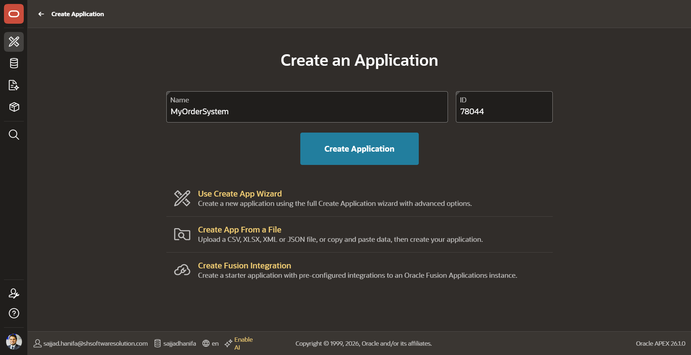

---

## Step 3 – App Overview

After clicking **„Create Application"**, APEX creates the app and brings you to the **Application home**. Three pages are created automatically:

| Page # | Name | Type |
|--------|------|------|
| 0 | Global Page | Global Page |
| 1 | Home | Normal |
| 9999 | Login Page | Login |

The **Login Page (9999)** is what users see before they authenticate — we will customize it in the next steps.


---

## Step 4 – Open Shared Components

Click on **„Shared Components"** in the top area of the App home. This section contains everything shared across all pages — authentication schemes, navigation menus, templates, and static files.

Take a look at the **„Files and Reports"** section on the right side. You will notice a small gray number next to **„Static Application Files"** — it shows **5**. These are the default icon files APEX creates automatically for every new application. Remember this number — at the end of this chapter it will be higher.

> 💡 Everything placed in Shared Components is available on every single page of your application.


---

## Step 5 – Open Static Application Files

In **Shared Components**, scroll to the section **„Files and Reports"** and click **„Static Application Files"**.

You will see exactly those **5 default icon files** that APEX added automatically (app icons in different sizes). We will now add our own files on top of these.

Click the blue **„Create File"** button in the top right corner.

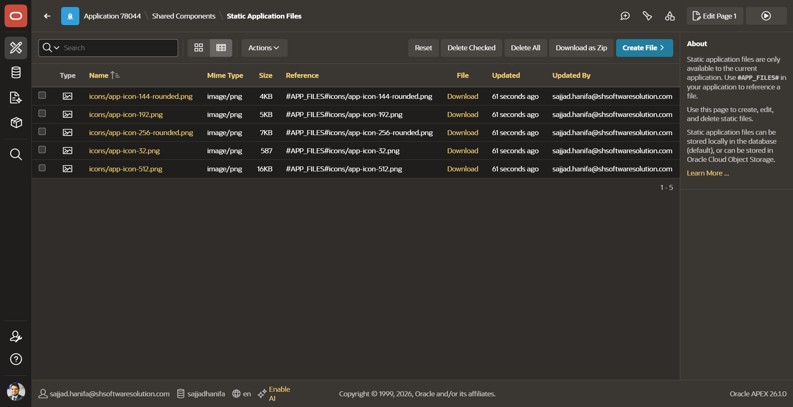

---

## Step 6 – Upload the Background Image

The **Create Application Static File** screen opens with a drag-and-drop area.

Drag your background image onto this area — or click it to open the file picker. For this workshop use the file **`MyOrderSystem.webp`** from the `scripts/` folder of this chapter.

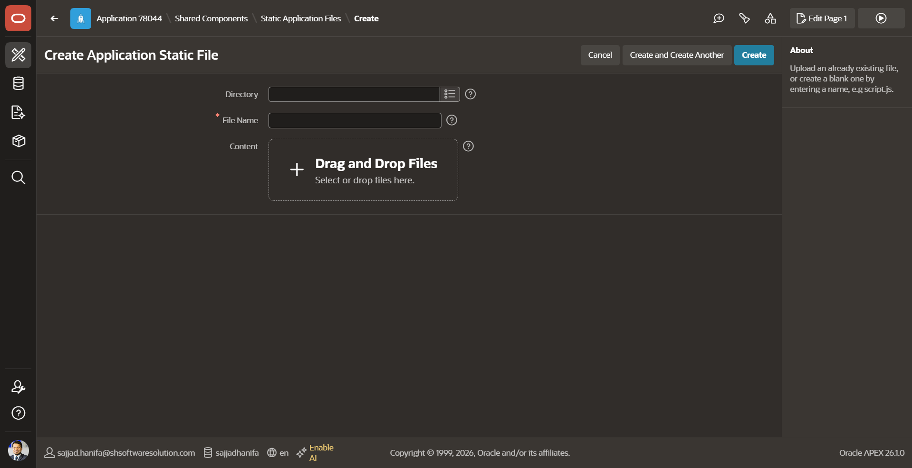

---

## Step 7 – Confirm the Image Selection

After dropping the file you will see it appear with its name and size — **MyOrderSystem.webp (181 KB)**.

The **File Character Set** is set to `Unicode UTF-8` automatically.

> ⚠️ Do **not** click **„Create"** here. Instead click **„Create and Create Another"** — this uploads the image and immediately opens a fresh upload form so you can create the next file without navigating back.

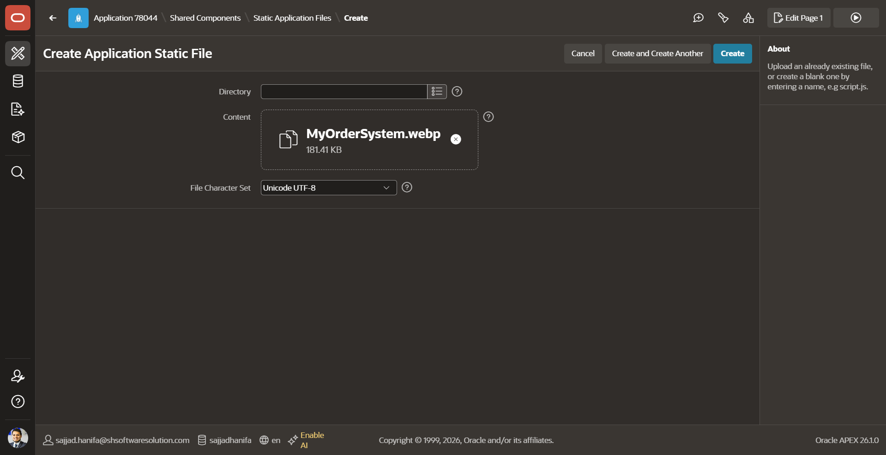

---

## Step 8 – Create the Global CSS File

APEX confirms the image upload with a green **„File(s) created"** banner at the top — the background image is saved.

The form is already open and ready for the next file. Enter the following in the **File Name** field:

```
global_css.css
```

Leave the **Content** area empty for now and click **„Create"** to save the CSS file.

> 💡 Using **„Create and Create Another"** in the previous step saved you from navigating back through the menus — APEX brought you straight here.

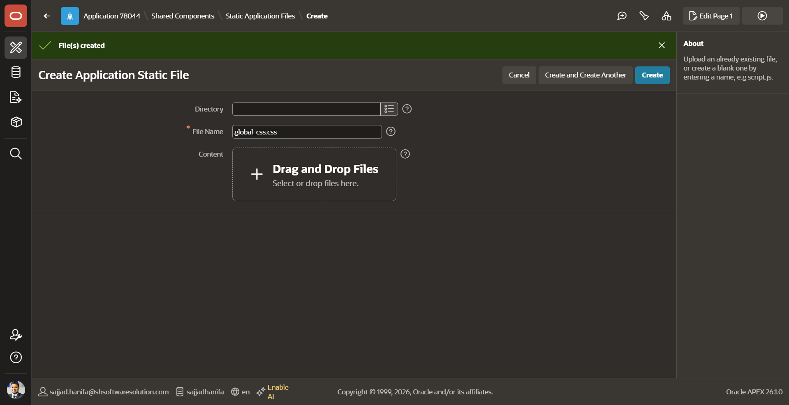

---

## Step 9 – Write Your CSS

The file editor for **global_css.css** opens. Here you can write CSS that will apply across your entire application.

Copy the code below and paste it into the editor. Click **„Save Changes"** when done.

- **File Name** → `global_css.css`
- **Reference** → `#APP_FILES#global_css#MIN#.css`
- **Mime Type** → `text/css`

```css
/*
================================================================================
  Workshop : Oracle APEX Workshop
  Chapter  : 03 – Create an App
  Style    : Login Region Design
  Author   : Sajjad Hanifa
  Company  : S&H Software Solutions
  Website  : https://shsoftwaresolution.com
  Version  : 1.0.0
  Date     : 2026-05-27
================================================================================
*/

/* === Login Region – Container Style =============================== */
/* Glass-style background with custom border and rounded corners     */
.my_custom_login_design {
  background                  : rgba(52, 109, 144, 0.10);
  color                       : #133c5d;
  border                      : 5px solid;
  box-shadow                  : inset 2px 2px 5px rgba(0, 0, 0, 0.3);
  border-top-left-radius      : 100px;
  border-bottom-right-radius  : 100px;
}

/* === Login Region – Input Fields & Buttons ======================== */
/* Rounded corners applied only to items inside the login region     */
.my_custom_login_design .apex-item-text,
.my_custom_login_design .t-Button {
  border-radius : 20px;
}
```

> 💡 The `#MIN#` token tells APEX to automatically minify your CSS in production — smaller file, faster load.

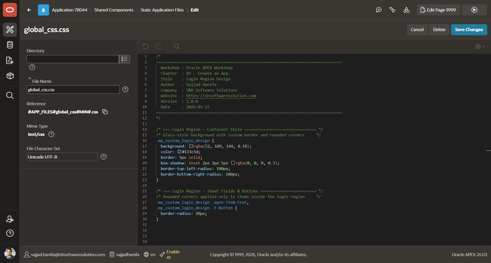

---

## Step 10 – Both Files Are Now Listed

Navigate back to **Static Application Files**. You will now see **7 files** in total — the 5 default icon files plus the 2 you just uploaded:

- `MyOrderSystem.webp` — the background image
- `global_css.css` — your custom stylesheet

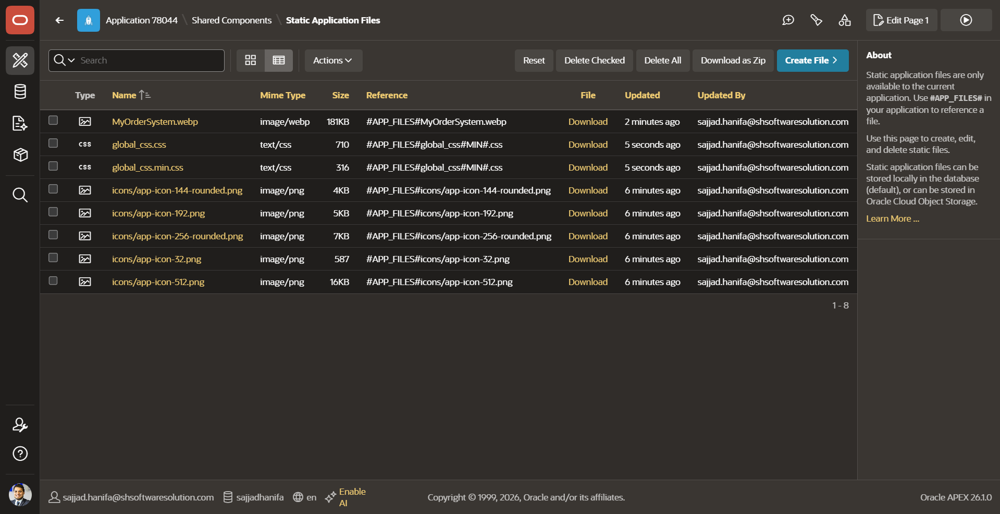

---

## Step 11 – Go Back to Shared Components

Navigate back to **Shared Components**. Before opening the Page Designer, we first need to link the `global_css.css` file so it loads on every page of the application.

Look at the **„Files and Reports"** section again — the gray number next to **„Static Application Files"** now shows **8** instead of 5. That confirms both your files were uploaded successfully.

In the **User Interface** section click **„User Interface Attributes"**.

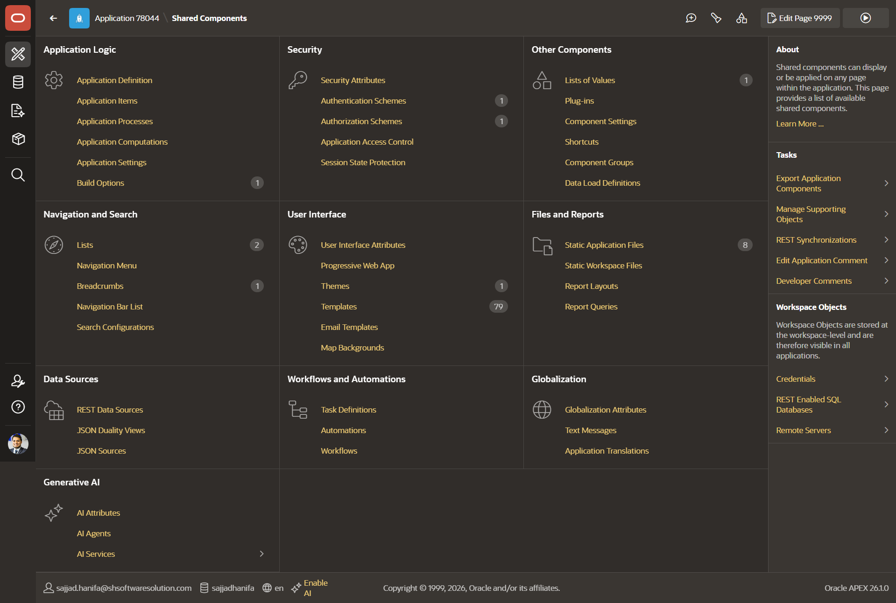

---

## Step 12 – Link the CSS File to the Application

In **User Interface Attributes**, click the **„CSS"** tab in the sub-navigation.

In the **File URLs** field enter the reference from Step 9:

```
#APP_FILES#global_css#MIN#.css
```

Click **„Apply Changes"** to save. Your CSS now loads on every page automatically.

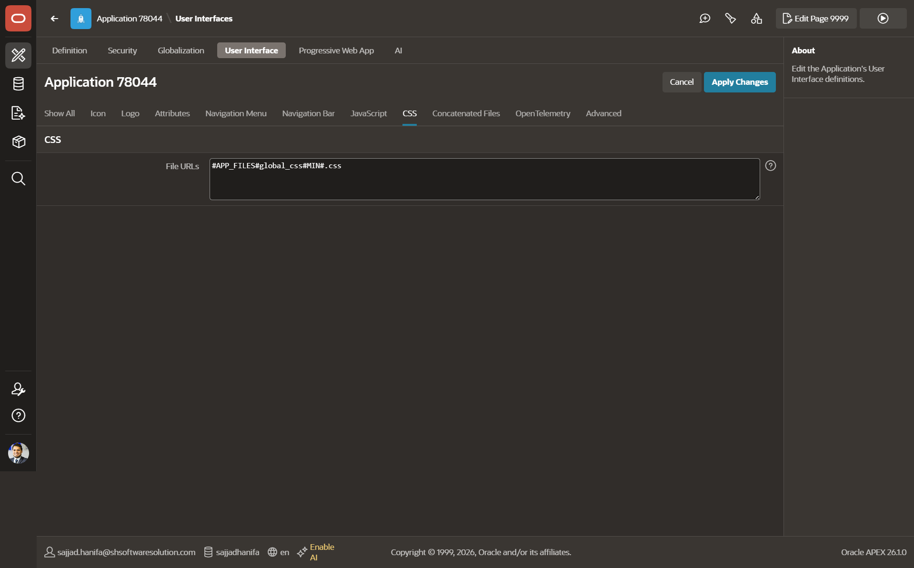

---

## Step 13 – Open the Login Page

Navigate back to the **App home**. In the page list click on **„Login Page"** (Page 9999) to open it in the **Page Designer**.

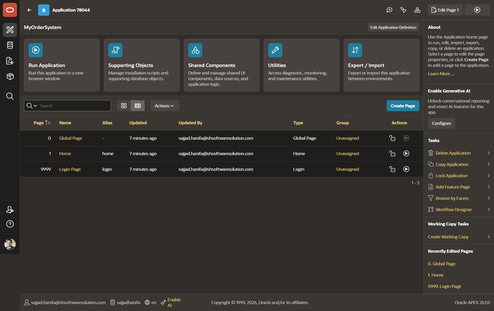

---

## Step 14 – Set the Background Image

In the **Page Designer** (Page 9999), click on **„Background Image"** in the left panel.

In the **Property Editor** on the right, find the **File URL** field under **Image** and enter:

```
#APP_FILES#MyOrderSystem.webp
```

Click **„Save"** to apply.

> 💡 Always use the `#APP_FILES#` token — never hardcode the actual file URL.

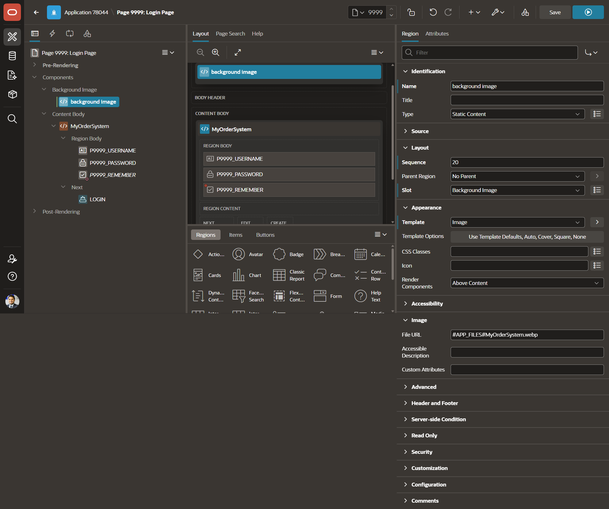

---

## Step 15 – Apply the CSS Class to the Login Region

Go back to **Page Designer** for Page 9999. This time click on the **Login region** (the main content region named **MyOrderSystem**) in the page tree.

In the **Property Editor** on the right, find the **CSS Classes** field under **Appearance** and enter:

```
my_custom_login_design
```

Click **„Save"**. Your login region now uses the styles from `global_css.css`.

> 💡 The CSS class name must exactly match the class selector in your CSS file (e.g. `.my_custom_login_design`).

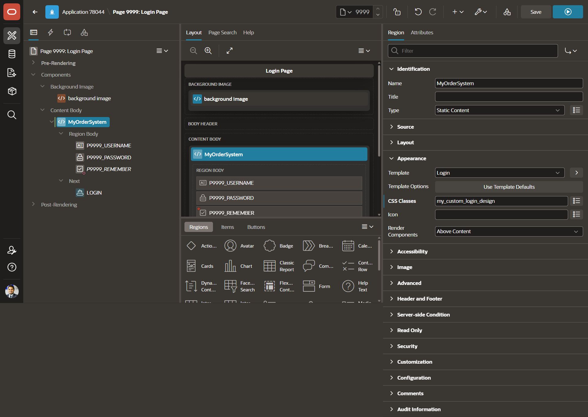

---

## Summary

- Every new APEX application comes with three default pages: **Global Page (0)**, **Home (1)**, and **Login Page (9999)**
- **Static Application Files** store images and CSS — referenced via `#APP_FILES#` tokens
- The **Login Page background image** is set in Page Designer on the Background Image component
- A **global CSS file** is created as a static file and linked via **Shared Components → User Interface Attributes → CSS**
- A **CSS class** is applied to the Login region via the **CSS Classes** field in Page Designer
- In the next chapter we will create a **database view** to prepare our data for display

---

## 🎉 Congratulations!

You did it! Take a look at your finished login page — your custom background image fills the screen, the login form sits on top with your custom design class applied, and the whole thing is live in Oracle APEX.

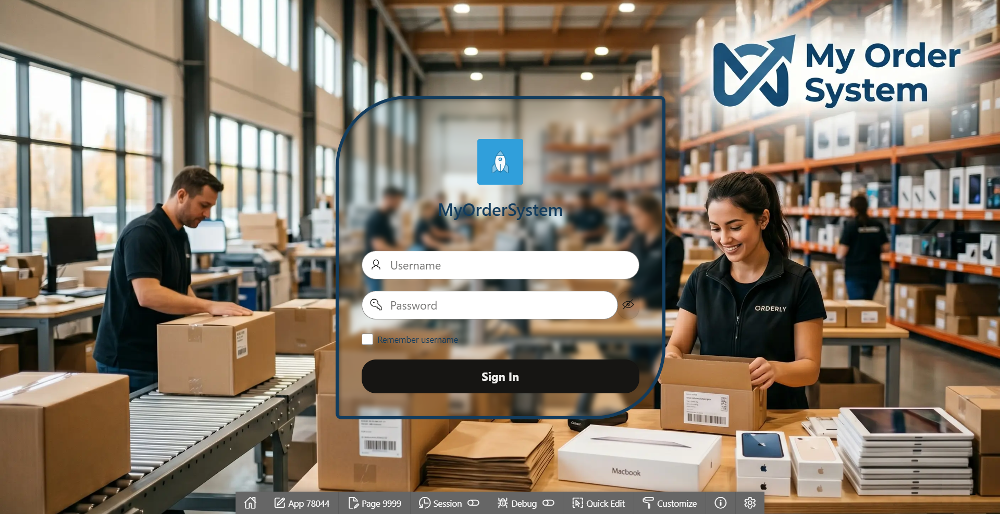

This is a real application running in the cloud. From a blank workspace to a fully styled, working login screen — great job making it this far! Every chapter from here builds on what you just created, so you are in exactly the right place to keep going.

---

[← Chapter 02](https://github.com/Sajjad-786/oracle-apex-workshop/blob/main/02_chapter_sql_import/02_chapter.md) | [↑ Back to Overview](https://github.com/Sajjad-786/oracle-apex-workshop/blob/main/README.md) | [→ Chapter 04](https://github.com/Sajjad-786/oracle-apex-workshop/blob/main/04_chapter_authentication/04_chapter.md)