<!--
  Workshop : Oracle APEX Workshop
  Chapter  : 04 – Authentication
  Author   : Sajjad Hanifa
  Company  : S&H Software Solutions
  Website  : https://shsoftwaresolution.com
  Version  : 1.4.0
  Date     : 2026-05-28
-->

# Chapter 04 – Authentication

> ⏱ Estimated Time: ~45 Minutes

---

## What will you learn?

In this chapter you will set up a custom authentication for your Oracle APEX application. Instead of using the built-in APEX user management, we build our own login logic using a PL/SQL package. This gives you full control over how users are validated — including company-level checks, account status, and expiry dates.

---

## What we will build

- A PL/SQL package `AUTHENTICATION` with three components:
  - `fn_hash_pass` – hashes the password securely using SHA256
  - `fn_authenticate_user` – validates user and company status
  - `pr_process_login` – the central login handler called by APEX
- An Application Item `LOGIN_MESSAGE` to carry the error message across the session
- A Login Alert region on Page 9999 to display the red error alert
- A Login process on Page 9999 calling the authentication package
- Two test users to verify the login works end to end

---

## Step 1 – Navigate to SQL Workshop

After logging into your workspace you will see the APEX Home with four main tiles: **App Builder**, **SQL Workshop**, **Data Reporter** and **Gallery**. The summary shows your application, tables and developer account. The system message confirms you are running **Oracle APEX 26.1**. Click on **SQL Workshop**.

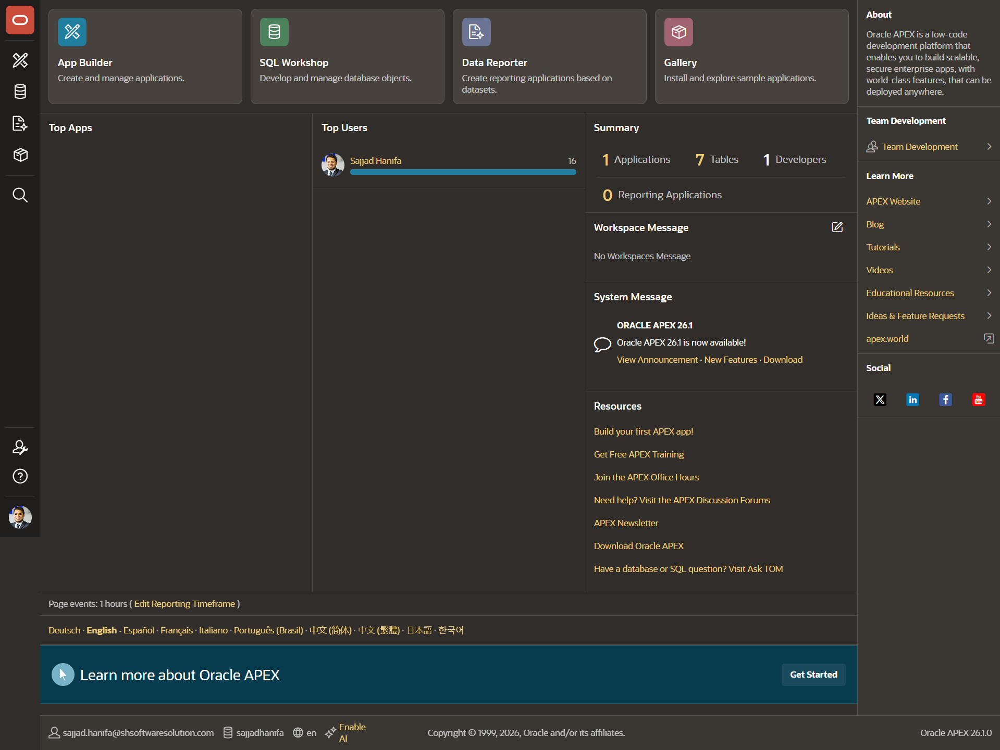

---

## Step 2 – Open SQL Scripts

The SQL Workshop home shows all available tools: **Object Browser**, **SQL Commands**, **SQL Scripts**, **Utilities** and **RESTful Services**. On the right you can already see the recently created tables from Chapter 02 — `USERS`, `COMPANIES`, `ORDERS`, `ITEMS` and more. Click on **SQL Scripts**.

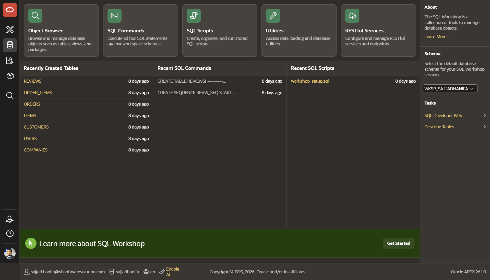

---

## Step 3 – Click Upload

The SQL Scripts list opens. You can see the existing `workshop_setup.sql` from Chapter 02. Click the **Upload** button in the top right corner to add the new script.

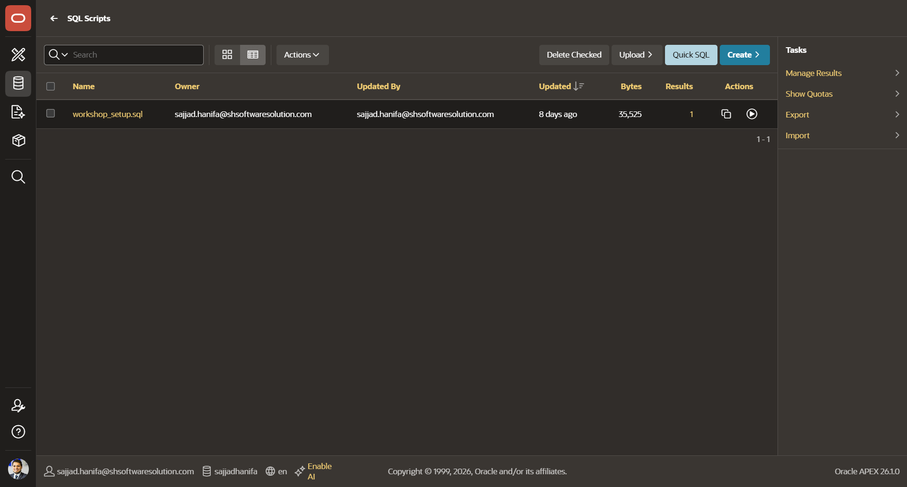

---

## Step 4 – Select the File

The **Upload Script** dialog opens with three fields: **File**, **Script Name** and **File Character Set** (already set to Unicode UTF-8). Click **Choose File** and select `authentication_pkg.sql` from the `scripts/` folder of this chapter.

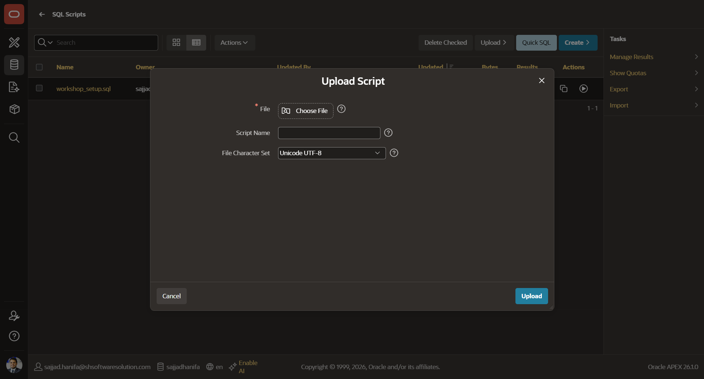

---

## Step 5 – File Selected

After selecting the file, `authentication_pkg.sql` appears in the file field with a small × to clear the selection. Leave **Script Name** empty — APEX will use the filename automatically. Click **Upload**.

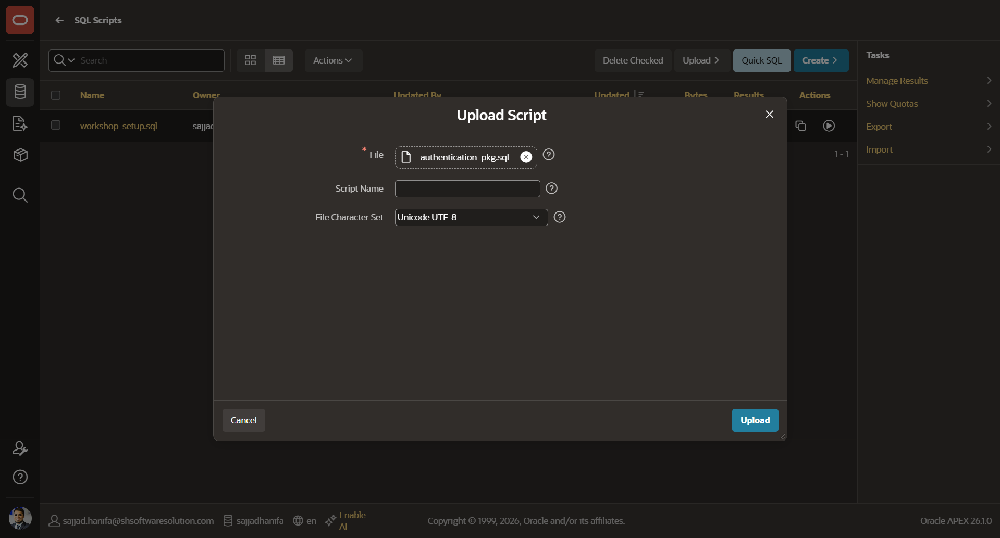

---

## Step 6 – Script Uploaded

The SQL Scripts list now shows two entries. The newly uploaded `authentication_pkg.sql` appears at the top — added **1 second ago**, **10,555 bytes**, **0 results** (not yet executed). Click on the script name to open it.

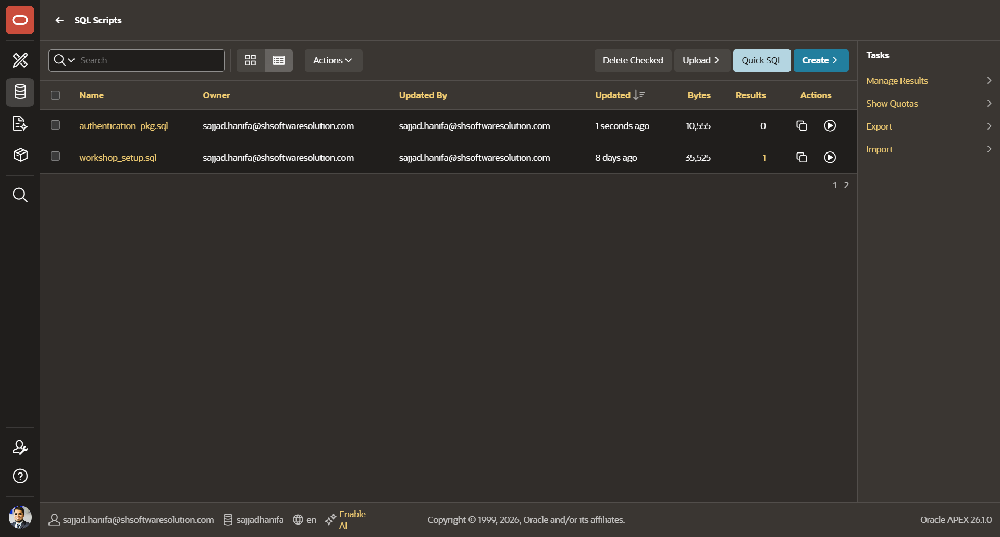

---

## Step 7 – Review the Script

The Script Editor opens and shows the full package — the S&H Software Solutions header, the change log and the package specification starting with `CREATE OR REPLACE PACKAGE authentication`. Take a moment to review the code. When ready, click the **Run** button in the top right corner.

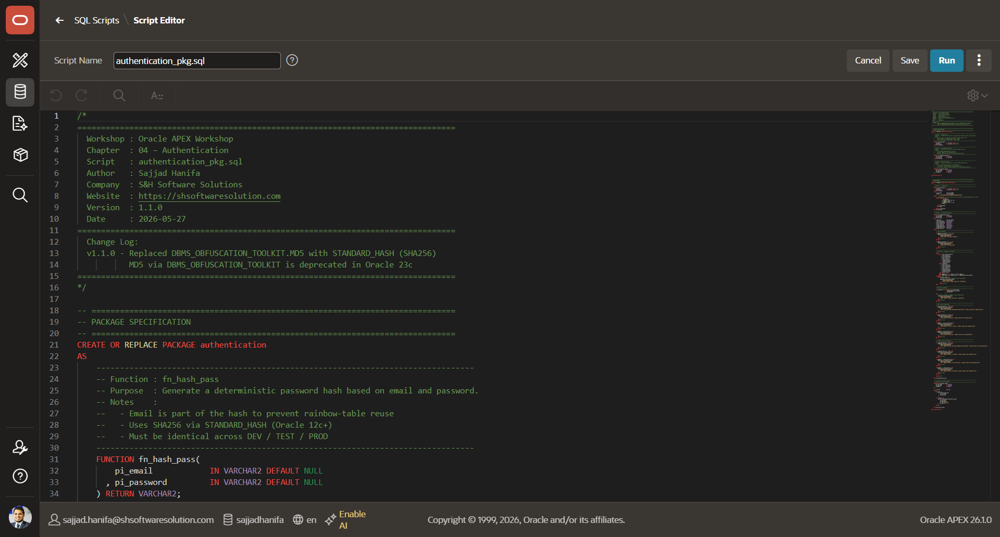

---

## Step 8 – Confirm the Run

A confirmation page shows all script details:

- **Script Name:** authentication_pkg.sql
- **Number of Statements:** 2
- **Script Size in Bytes:** 11,083

Click **Run** to execute.

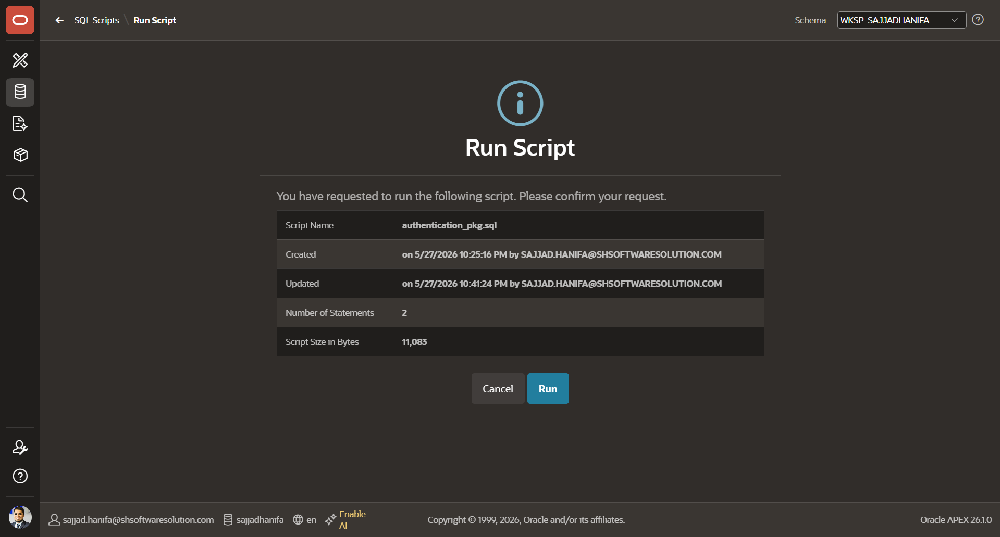

---

## Step 9 – Check the Results

The Results page opens in **Summary** view. You should see:

- **2** Statements Processed
- **2** Successful
- **0** With Errors

The detail table confirms:
- Statement 1 → `Package created.`
- Statement 2 → `Package Body created.`

Both the Package Spec and Package Body compiled without errors.

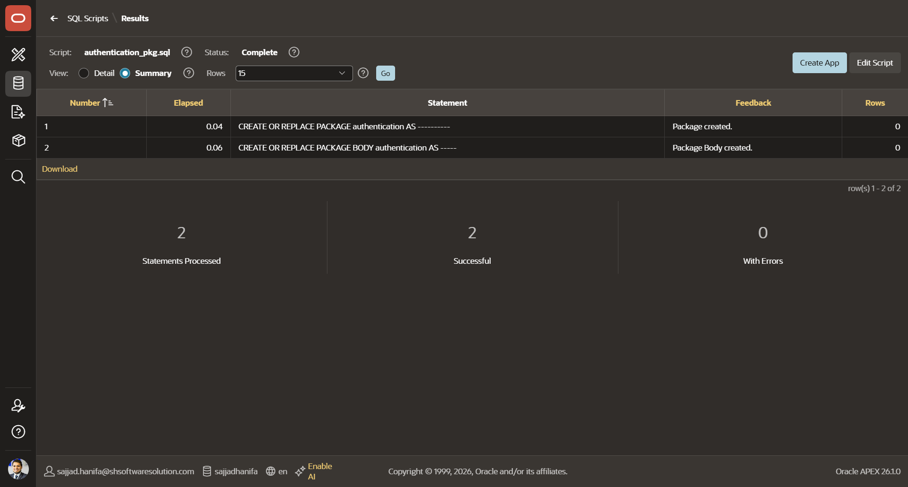

---

## Step 10 – Go to App Builder

Navigate to **App Builder** and open your application **MyOrderSystem**. You will see the pages listed — **Global Page**, **Home** and **Page 9999 – Login Page**. This is your starting point for the next steps.

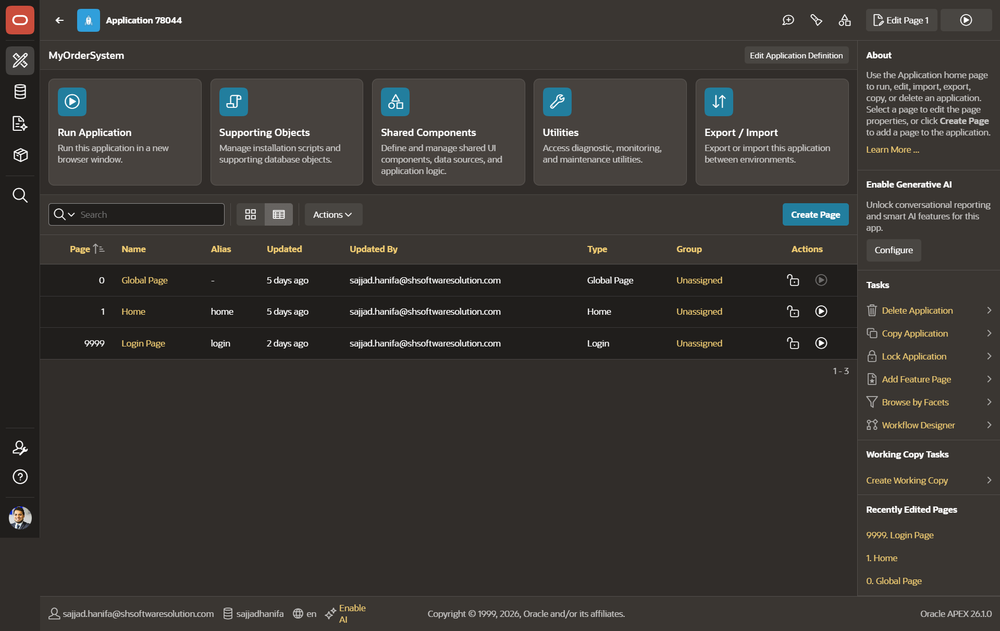

---

## Step 11 – Open Shared Components (CSS)

Click **Shared Components** from the application home. This is where all global application settings are managed — including static files, authentication schemes and application items.

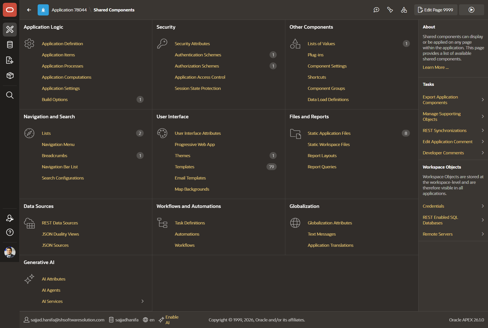

---

## Step 12 – Open Static Application Files

Under the **Files and Reports** section click **Static Application Files**. You will see `global_css.css` — the global stylesheet for your application. Click on it to open the file editor.

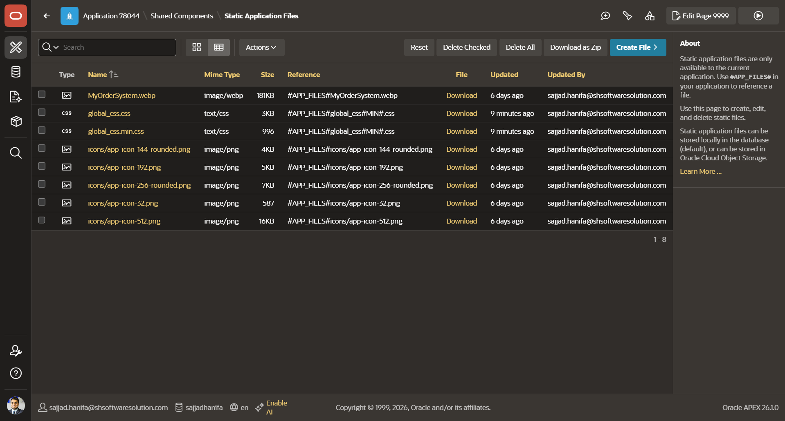

---

## Step 13 – Review the Existing CSS

The file editor opens showing the existing CSS from the previous chapter — the `.my_custom_login_design` styles for the login region. Scroll down to the **bottom** of the file to add the new login alert styles.

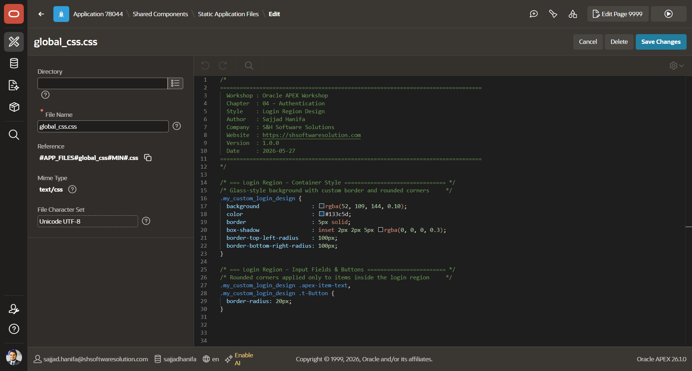

---

## Step 14 – Add the Login Alert CSS and Save

Copy the CSS below and paste it at the **bottom** of `global_css.css`. Then click **Save Changes**.

```css
/* === Login Alert ================================================== */
.p9999_login_alert {
  display        : flex;
  align-items    : center;
  gap            : 10px;
  width          : 100%;
  padding        : 12px 16px;
  border-radius  : 50px;
  background     : rgb(255, 61, 61);
  border         : 1px solid rgba(255, 61, 61, .45);
  box-shadow     : 0 0 10px rgba(0, 0, 0, .15);
  font-family    : "Segoe UI", Arial, sans-serif;
  font-size      : 15px;
  line-height    : 1.35;
  font-weight    : 600;
  color          : #ffffff;
  box-sizing     : border-box;
}
```

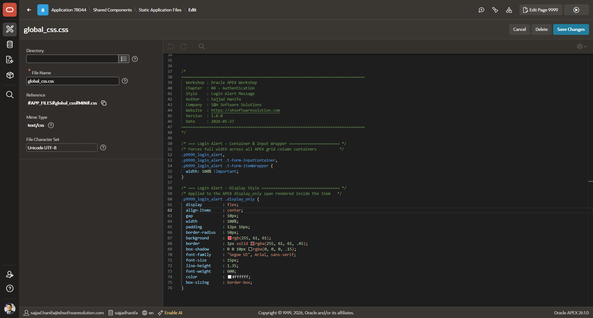

---

## Step 15 – Go to SQL Commands

Navigate to **SQL Workshop** and click **SQL Commands** to open the interactive SQL editor.

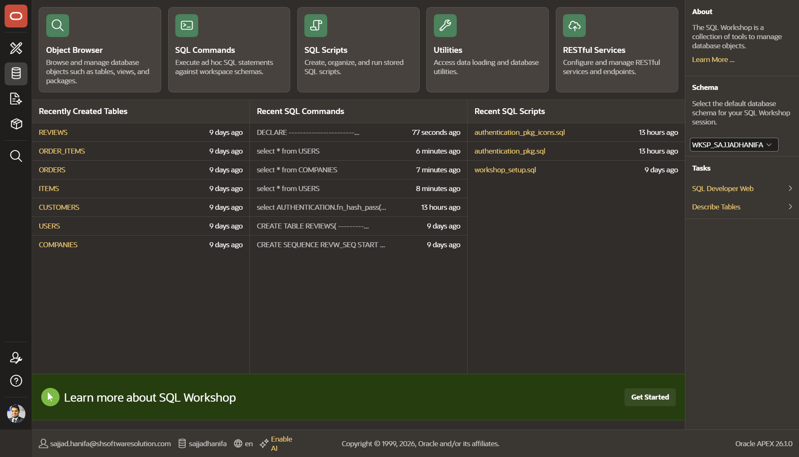

---

## Step 16 – Create Test Users

Copy the `DECLARE` block below into SQL Commands and click **Run**.

> ✏️ **Change these values before running:**
> - `v_upd_email` / `v_upd_password` → your existing user's email and the password you want to set
> - `v_new_first_name`, `v_new_last_name`, `v_new_email`, `v_new_password` → details for the second test user

```sql
DECLARE
    -- -------------------------------------------------------------------------
    -- Update existing user – change email and password to your own values
    -- -------------------------------------------------------------------------
    v_upd_email       VARCHAR2(200) := 'john.doe@shsoftwaresolution.com';
    v_upd_password    VARCHAR2(200) := 'Admin123!';

    -- -------------------------------------------------------------------------
    -- New user – enter first name, last name, email and password
    -- -------------------------------------------------------------------------
    v_new_first_name  VARCHAR2(200) := 'Jane';
    v_new_last_name   VARCHAR2(200) := 'Smith';
    v_new_email       VARCHAR2(200) := 'jane.smith@shsoftwaresolution.com';
    v_new_password    VARCHAR2(200) := 'Summer2024!';

    -- -------------------------------------------------------------------------
    -- Internal variables – do not change
    -- -------------------------------------------------------------------------
    v_comp_id         NUMBER;
BEGIN
    -- Find company
    SELECT comp_id
      INTO v_comp_id
      FROM companies
     WHERE comp_short_name = 'SH-SS';

    DBMS_OUTPUT.Put_Line('Company found: ' || v_comp_id);

    -- Update existing user password
    UPDATE users
       SET user_login_password = authentication.fn_hash_pass(
                                     LOWER(TRIM(v_upd_email))
                                   , v_upd_password
                                 )
     WHERE LOWER(TRIM(user_login_email)) = LOWER(TRIM(v_upd_email));

    DBMS_OUTPUT.Put_Line('Updated user: ' || v_upd_email);

    -- Insert new user
    INSERT INTO users (
        user_comp_fk
      , user_first_name
      , user_last_name
      , user_login_email
      , user_login_password
      , user_active_yn
      , user_deleted_yn
      , user_valid_from
      , user_valid_to
    ) VALUES (
        v_comp_id
      , v_new_first_name
      , v_new_last_name
      , LOWER(TRIM(v_new_email))
      , authentication.fn_hash_pass(LOWER(TRIM(v_new_email)), v_new_password)
      , 'YES'
      , 'NO'
      , SYSDATE
      , SYSDATE + 365
    );

    DBMS_OUTPUT.Put_Line('Inserted new user: ' || v_new_first_name || ' ' || v_new_last_name);

    COMMIT;
    DBMS_OUTPUT.Put_Line('COMMIT successful.');
END;
```

After execution you should see in the output:

```
Company found: ...
Updated user: john.doe@shsoftwaresolution.com
Inserted New User: Jane Smith
COMMIT successful.
```

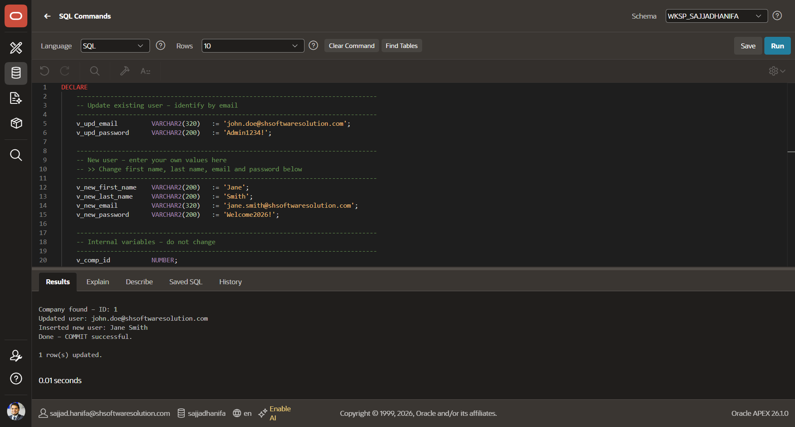

---

## Step 17 – Back to App Builder

Navigate back to **App Builder** and open your application. All pages are visible — **Global Page**, **Home** and **Page 9999 – Login Page**. The next steps will complete the Page 9999 setup.


---

## Step 18 – Open Shared Components (Application Items)

From the application home click **Shared Components** again. This time you will create an Application Item to store the login error message so it is available across the session.


---

## Step 19 – Open Application Items

In Shared Components, under **Application Logic**, click **Application Items**. The list is currently empty — no application level items exist yet. Click **Create** to add a new one.

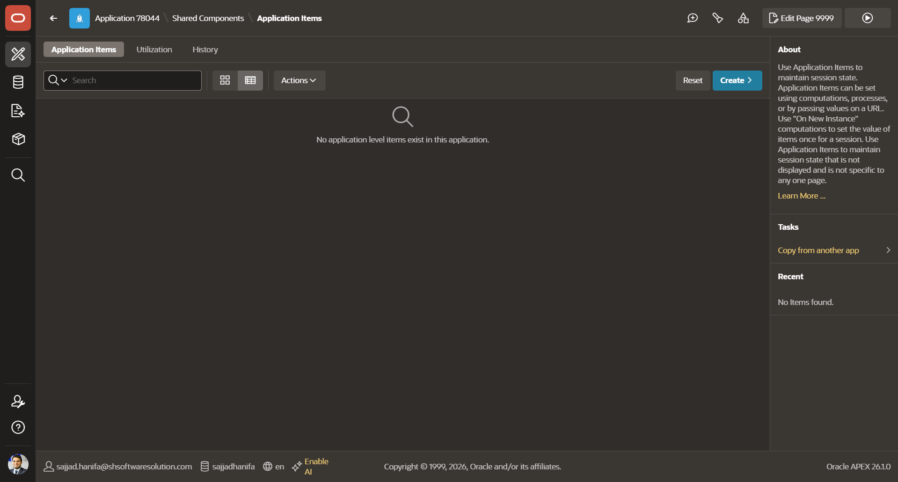

---

## Step 20 – Create the LOGIN_MESSAGE Item

The Create / Edit Application Item form opens. Fill in the following:

- **Name:** `LOGIN_MESSAGE`
- **Scope:** Application
- **Session State Protection:** Unrestricted

Leave all other fields as default and click **Create Application Item**.

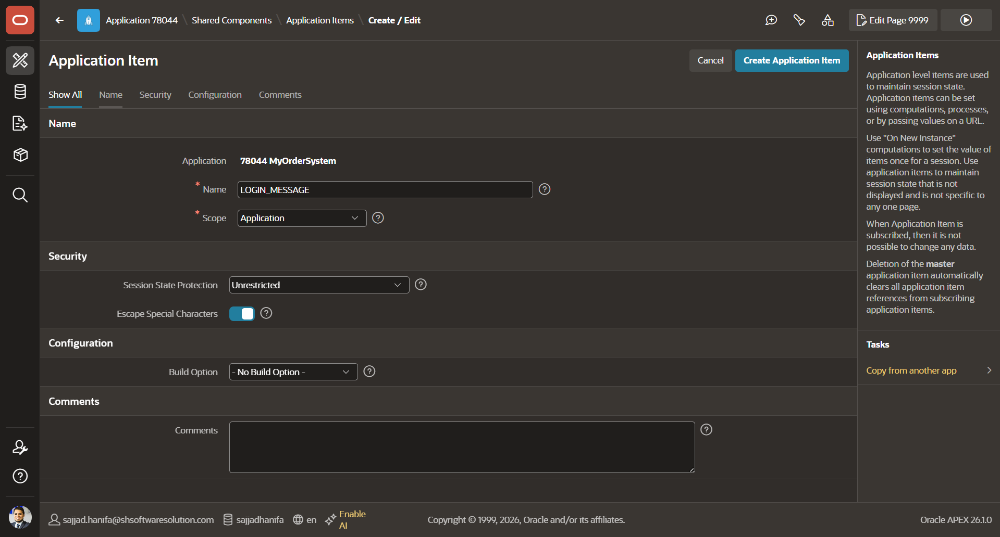

---

## Step 21 – Item Saved

The Application Items list now shows `LOGIN_MESSAGE` with a green success banner **"Application Item saved."** — scope is Application, protection is Unrestricted. In the top right corner you see the **Edit Page 9999** button. Click it to go directly to the Login Page Designer.

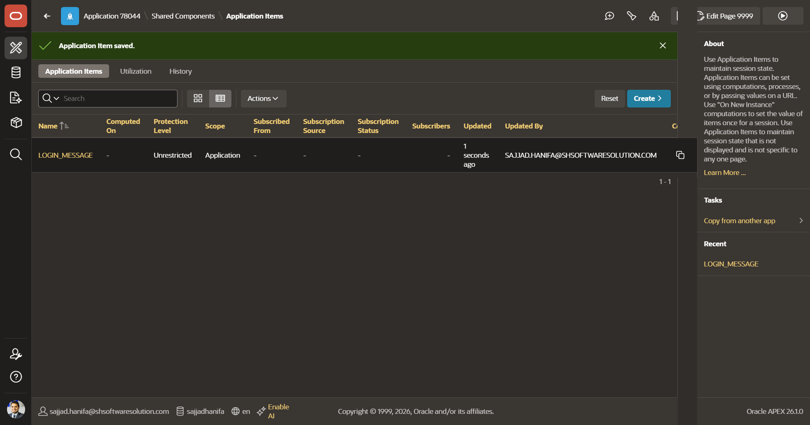

---

## Step 22 – Create the Login Alert Region

Page Designer opens for Page 9999. In the left page tree you can see the existing regions and items. Add a new **Static Content** region with the following settings:

- **Name:** `Login Alert`
- **Type:** Static Content
- **HTML Body:**
  ```html
  <div class="p9999_login_alert">&LOGIN_MESSAGE.</div>
  ```
- **Server-side Condition:** Item is NOT NULL → `LOGIN_MESSAGE`

This region will only render when the authentication package has set an error message.

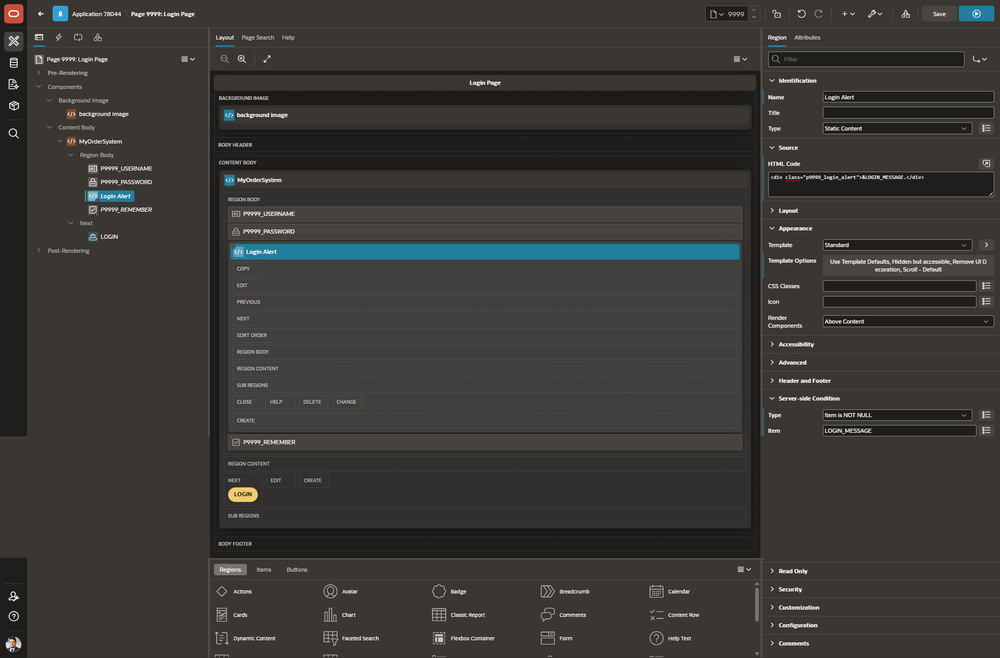

---

## Step 23 – Set Up the Login Process

Click on the **Login** process in the page tree. In the right property panel you can see it is configured as an **Invoke API** calling `AUTHENTICATION.PR_PROCESS_LOGIN` with `pi_user_name` and `pi_password` as parameters. The success message is already set. This process runs when the user clicks Sign In.

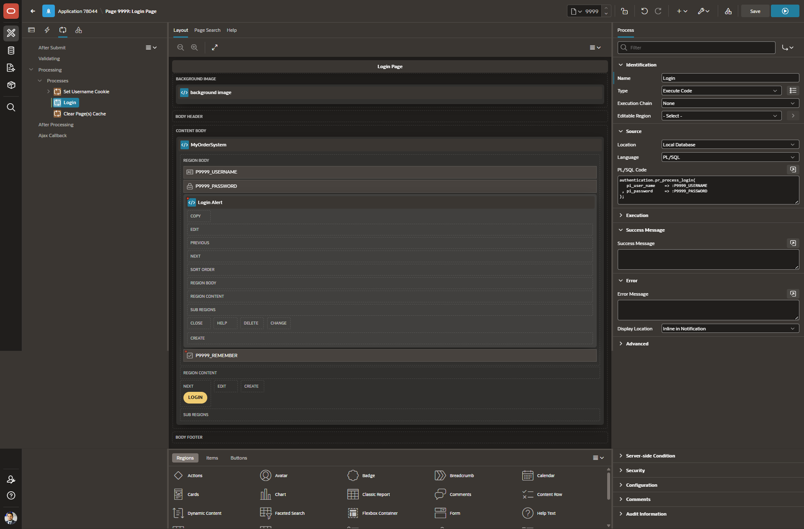

---

## Step 24 – Complete Page Overview

The full Page 9999 now has all elements in place. In the left page tree you can see the complete structure:

- `P9999_USERNAME` and `P9999_PASSWORD` — the login input fields
- `Login Alert` — the red error alert region
- `P9999_REMEMBER` — the Remember Me checkbox
- `LOGIN` — the Sign In button
- Login process in Pre-Rendering

Click **Save** to save all changes.

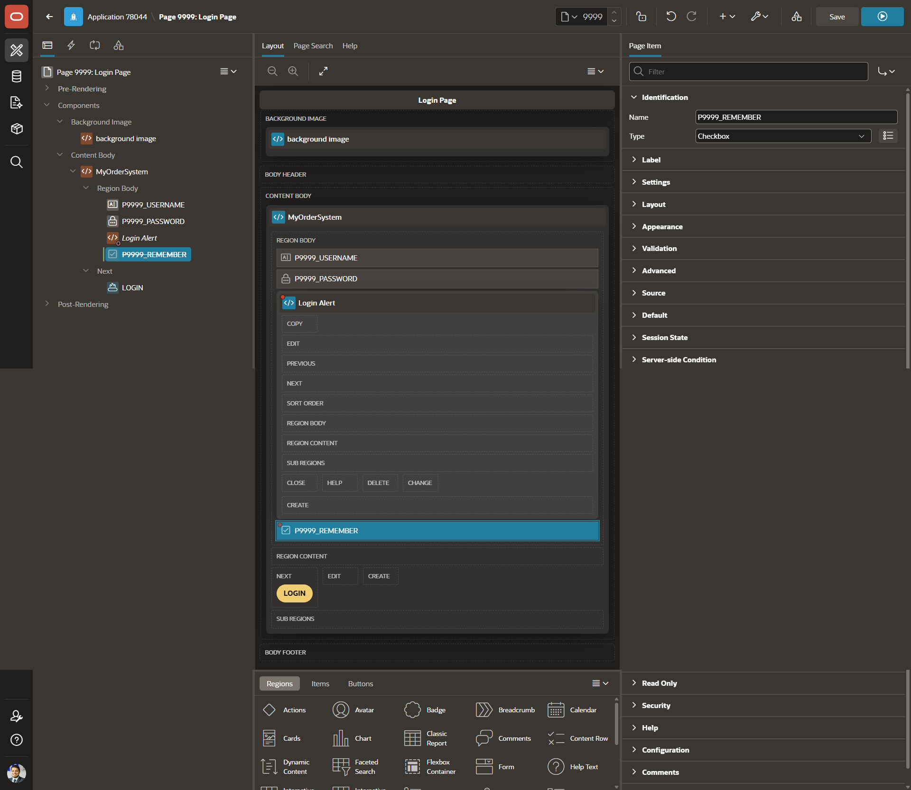

---

## Step 25 – The Finished Login Page

Open your application. You will see the fully styled login page — the custom warehouse background image, the **My Order System** logo in the top right, and the clean login form with **Username** and **Password** fields and a **Sign In** button. This is the finished result.

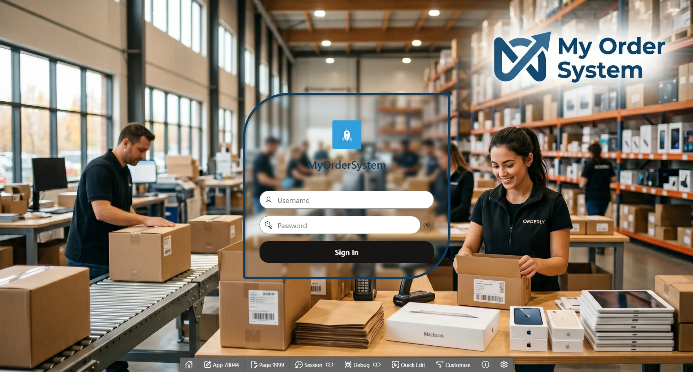

---

## Step 26 – Enter Your Credentials

Enter your email address (for example `john.doe@shsoftwaresolution.com`) in the Username field and your password in the Password field. Click **Sign In**.

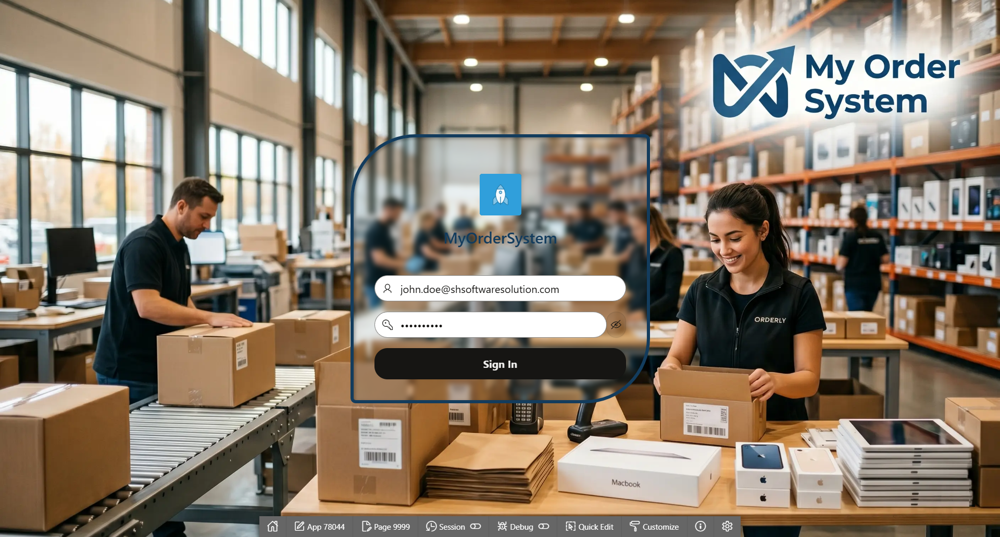

---

## Step 27 – Successfully Logged In

You are now inside the application. The **MyOrderSystem** home page appears with the navigation bar on the left and your email address `john.doe@shsoftwaresolution.com` visible in the top right corner. The custom authentication is working perfectly end to end.

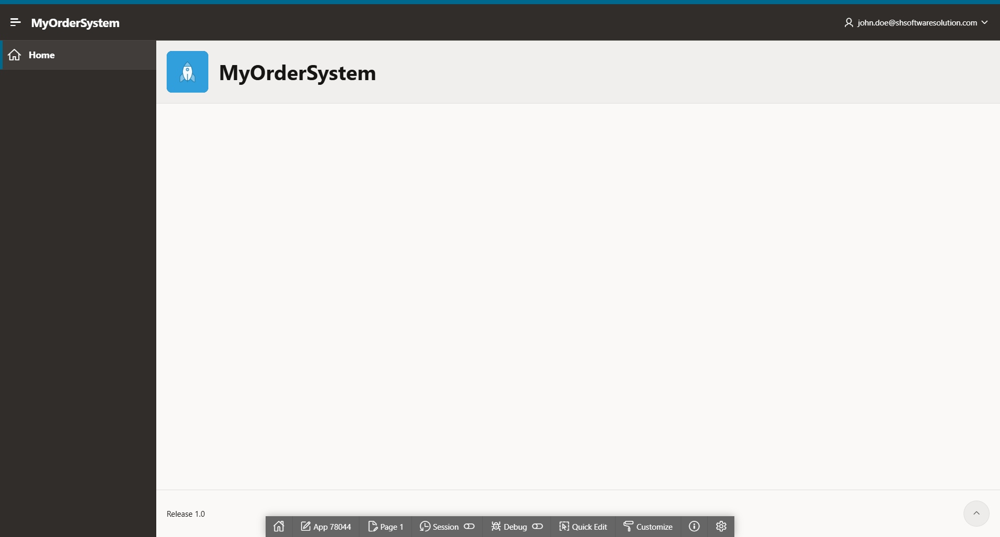

---

## How the validation works

| Check | Error Message |
|---|---|
| Email is empty | Please enter your email address |
| Password is empty | Please enter your password |
| User not found | Login failed – please check your credentials |
| Wrong password | Login failed – please check your credentials |
| User deleted | Your account has been permanently deactivated |
| User inactive | Your account is inactive |
| User not yet active | Your account is not yet active |
| User expired | Your account has expired |
| Company deleted | Your company account has been permanently deactivated |
| Company inactive | Your company account is inactive |
| Company not yet active | Your company account is not yet active |
| Company expired | Your company account has expired |

> 💡 **Note:** User not found and wrong password intentionally show the same message — this prevents attackers from finding out whether an account exists.

---

## Test Your Login

Use these two accounts to test both login scenarios:

| User | Email | Password |
|---|---|---|
| Existing user | `john.doe@shsoftwaresolution.com` | `Admin123!` |
| New user | `jane.smith@shsoftwaresolution.com` | `Summer2024!` |

Also try entering a wrong password or leaving the email empty — the red alert appears immediately with the matching error message.

---

## Scripts

All SQL/PL/SQL scripts are located in the `scripts/` folder.

| File | Description |
|---|---|
| `authentication_pkg.sql` | Full package spec and body |

---

## Tips & Notes

- Always use `LOWER(TRIM(...))` when comparing email addresses — prevents login failures from spaces or uppercase
- `STANDARD_HASH` is a SQL function — in PL/SQL call it via `SELECT ... FROM DUAL`
- Never change the salt after going live — all existing passwords would break
- `pr_process_login` reads `APP_ID` internally via `v('APP_ID')` — no need to pass it from APEX
- The `Login Alert` region must have a Server-side Condition so it only renders when `LOGIN_MESSAGE` is not null
- `LOGIN_MESSAGE` is an Application Item (not a Page Item) — it is available across the entire session

---

## ✅ Chapter Complete!

You have successfully built a fully custom authentication system from scratch — a PL/SQL package with SHA256 password hashing, multi-level status checks for both user and company, a clean red login alert, two working test accounts, and a beautiful login page with a custom background. Your application now has a professional, secure login that you have complete control over. Well done — on to the next chapter!

[← Chapter 03](https://github.com/Sajjad-786/oracle-apex-workshop/blob/main/03_chapter_create_app/03_chapter.md) | [↑ Back to Overview](https://github.com/Sajjad-786/oracle-apex-workshop/blob/main/README.md) | [→ Chapter 05](https://github.com/Sajjad-786/oracle-apex-workshop/blob/main/05_chapter_form_lowcode/05_chapter.md)
